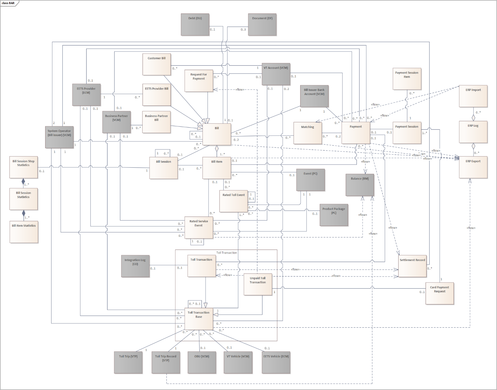
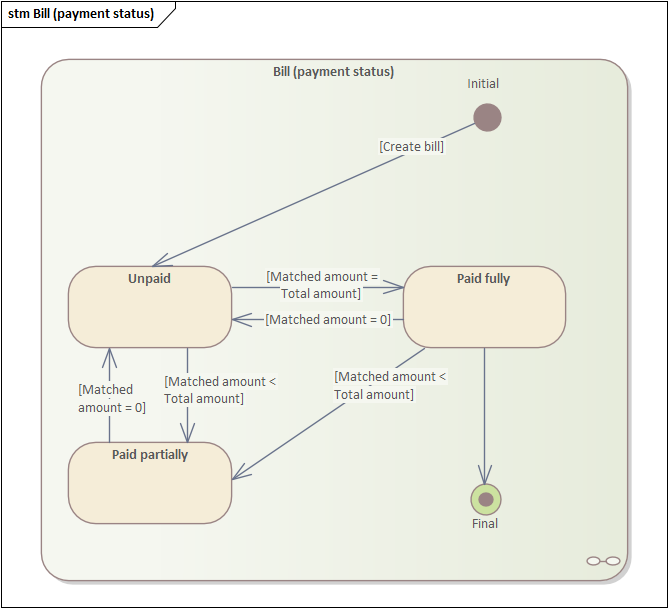
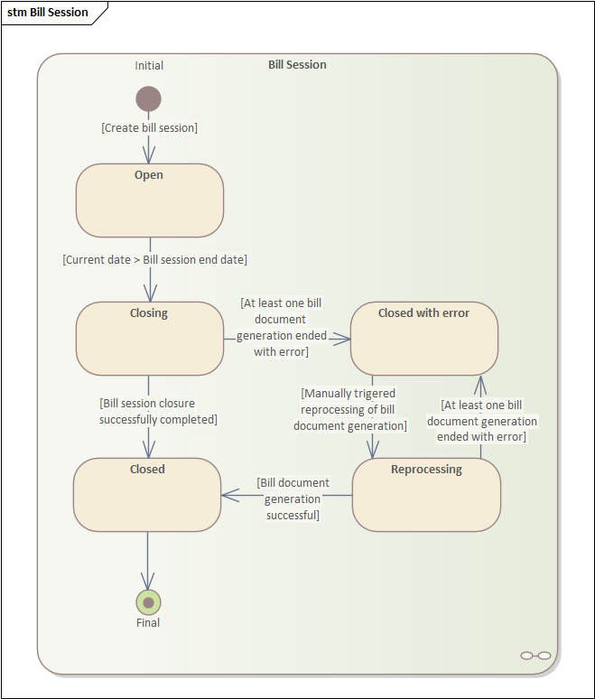
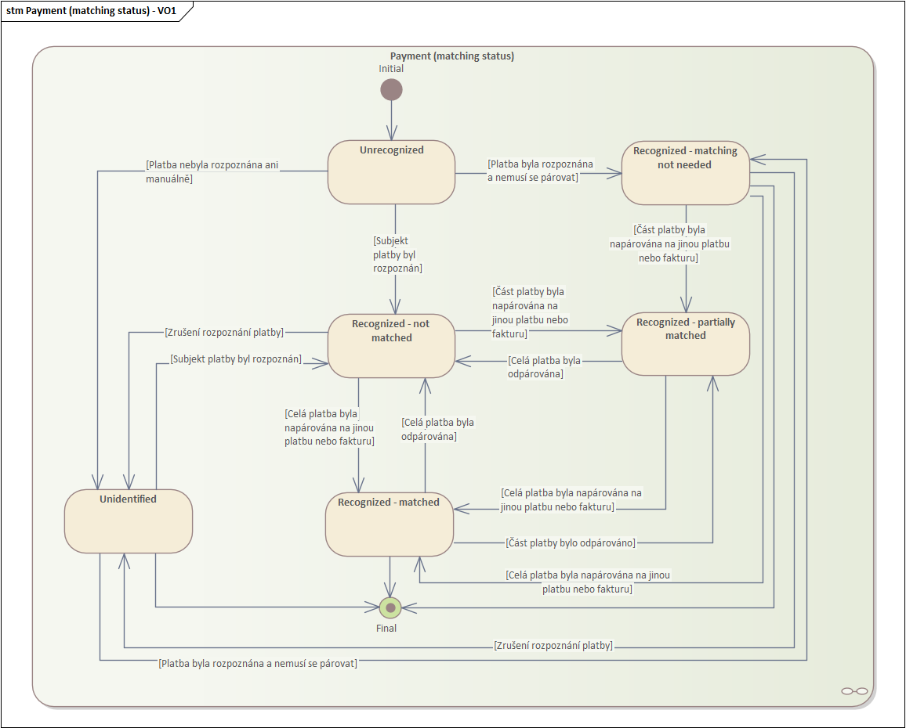
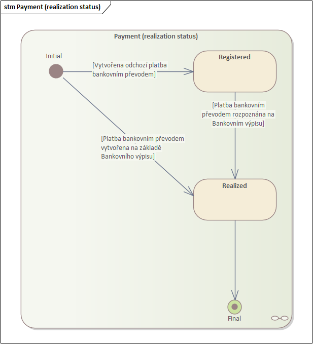
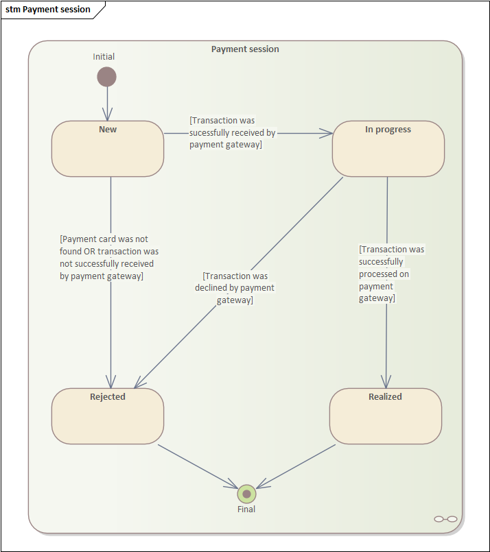

{width="1.968503937007874in" height="0.6653543307086615in"}exempted

Billing and Accounts Receivables (BAR)

Funkční specifikace Billien

Release 5.83

26.08.2025

**Poučení o autorských právech**

Tento dokument byl vytvořen společností TollNet a.s.

Žádná část tohoto dokumentu nesmí být šířena, reprodukována nebo jakýmkoli způsobem použita jinak než s výslovným souhlasem společnosti TollNet a.s.. Autorská práva a výše uvedená omezení se vztahují na reprodukci na všech médiích a všemi způsoby.

Copyright © 2025 by TollNet a.s. All rights reserved.

**Poučení o ochranných známkách**

Označení Billien a logo společnosti TollNet a.s. jsou Ochranné známky společenství (CTM) registrované společností TollNet a.s. Jakékoli další označení použité v tomto dokumentu může být ochrannou známkou, jejíž použití třetí stranou pro vlastní účely může porušovat chráněná práva jí příslušného vlastníka.

**Disclaimer**

Tento dokument neposkytuje žádnou výslovnou ani předpokládanou záruku společnosti TollNet a.s. o jejích produktech a/nebo službách. Jakékoli závazné informace o vlastnostech produktů a/nebo služeb a záručních lhůtách a podmínkách jsou obsaženy ve smluvních dokumentech a případně uživatelské dokumentaci, která je dodána společně s těmito produkty a/nebo službami. Rozsah použitelnosti dodané uživatelské dokumentace může být upřesněn smluvními dokumenty. Zákazník je odpovědný za vlastní nezávislé posouzení vhodnosti jakéhokoli produktu a/nebo služby pro svou podnikatelskou činnost.

Jakékoli informace nebo specifikace obsažené v tomto dokumentu mohou být změněny nebo aktualizovány bez předchozího oznámení.

# 

# Obsah {#obsah .TOC-Heading}

[Obsah [4](#obsah)](#obsah)

[Historie dokumentu [9](#_Toc205285640)](#_Toc205285640)

[1 Úvod [13](#úvod)](#úvod)

[1.1 Procesy HR [13](#_Toc205285642)](#_Toc205285642)

[1.1.1 Předplacení kreditu [13](#_Toc205285643)](#_Toc205285643)

[1.1.2 Uložení mýtných transakcí [15](#_Toc205285644)](#_Toc205285644)

[1.1.3 Vystavení pravidelné faktury za mýtné [16](#_Toc205285645)](#_Toc205285645)

[1.1.4 Vystavení jednorázové faktury [17](#_Toc205285646)](#_Toc205285646)

[[1.1.5]{.mark} [Vystavení pravidelné výzvy na úhradu za platby tankovací kartou]{.mark} [18](#_Toc205285647)](#_Toc205285647)

[1.1.6 Re-rating [18](#_Toc205285648)](#_Toc205285648)

[2 Doménový model [19](#doménový-model)](#doménový-model)

[2.1 Diagram doménového modelu [19](#diagram-doménového-modelu)](#diagram-doménového-modelu)

[2.2 Přehled entit [21](#_Toc205285651)](#_Toc205285651)

[2.3 Atributy entit [23](#atributy-entit)](#atributy-entit)

[2.3.1 Bill (Faktura) [23](#test-entity)](#test-entity)

[2.3.2 Bill Item (Položka faktury) [29](#bill-item-položka-faktury)](#bill-item-položka-faktury)

[2.3.3 Bill Session (Fakturační dávka) [33](#bill-session-fakturační-dávka)](#bill-session-fakturační-dávka)

[2.3.4 Payment (Platba) [35](#payment-platba)](#payment-platba)

[2.3.5 Payment Session (Platební transakce) [41](#payment-session-platební-transakce)](#payment-session-platební-transakce)

[2.3.1 Payment Session Item (Položka platební transakce) [45](#_Toc205285658)](#_Toc205285658)

[2.3.2 Matching (Párování plateb) [46](#matching-párování-plateb)](#matching-párování-plateb)

[2.3.3 Toll Transaction Base (Mýtná transakce - základ) [47](#_Toc205285660)](#_Toc205285660)

[2.3.4 Rated Toll Event (Oceněná mýtná událost) [54](#_Toc205285661)](#_Toc205285661)

[2.3.5 Rated Service Event (Oceněná služba) [56](#_Toc205285662)](#_Toc205285662)

[2.3.6 Bill Session Statistics (Statistika fakturační dávky) [59](#_Toc205285663)](#_Toc205285663)

[2.3.7 Bill Session Steps Statistics (Statistika kroků fakturační dávky) [61](#_Toc205285664)](#_Toc205285664)

[2.3.8 Bill Item Statistics (Statistika fakturační dávky podle Bill item typu a Měny) [62](#_Toc205285665)](#_Toc205285665)

[[2.3.9]{.mark} [Settlement Record (Záznam vyrovnání)]{.mark} [62](#_Toc205285666)](#_Toc205285666)

[2.3.10 Card Payment Request (Požadavek na platbu kartou) [63](#_Toc205285667)](#_Toc205285667)

[[2.3.11]{.mark} [ERP Log (ERP Log)]{.mark} [63](#_Toc205285668)](#_Toc205285668)

[[2.3.12]{.mark} [ERP Import (ERP Import)]{.mark} [63](#_Toc205285669)](#_Toc205285669)

[[2.3.13]{.mark} [ERP Export (ERP Export)]{.mark} [64](#_Toc205285670)](#_Toc205285670)

[2.4 Atributy konfigurovatelných číselníků [65](#_Toc205285671)](#_Toc205285671)

[2.4.1 Payment Type (Typ platby) [65](#_Toc205285672)](#_Toc205285672)

[2.4.2 Currency (Měna) [65](#_Toc205285673)](#_Toc205285673)

[2.4.3 Rounding (Zaokrouhlování) [67](#_Toc205285674)](#_Toc205285674)

[2.4.4 CorvusPay Payment Method (CorvusPay platební metoda) [67](#_Toc205285675)](#_Toc205285675)

[[2.4.5]{.mark} [Card type (Typ karty)]{.mark} [68](#_Toc205285676)](#_Toc205285676)

[2.4.6 CorvusPay Response Code (CorvusPay kód odpovědi) [68](#_Toc205285677)](#_Toc205285677)

[2.4.7 Process Step Scheduling (Plánování kroků zpracování) [69](#_Toc205285678)](#_Toc205285678)

[2.5 Vysvětlení ke specifikaci entit a atributů entit [70](#_Toc205285679)](#_Toc205285679)

[3 Aktéři [73](#_Toc205285680)](#_Toc205285680)

[3.1 Seznam aktérů [73](#_Toc205285681)](#_Toc205285681)

[[3.2]{.mark} [Seznam rolí]{.mark} [73](#_Toc205285682)](#_Toc205285682)

[3.3 Pracovní týmy [73](#_Toc205285683)](#_Toc205285683)

[4 Případy užití [75](#případy-užití)](#případy-užití)

[4.1 Operace s platbami [76](#_Toc205285685)](#_Toc205285685)

[4.1.1 Zaplať předplacený kredit -- Pre-paid in single domain (UC.BAR.0.1.HR) [76](#zaplať-předplacený-kredit-pre-paid-in-single-domain-uc.bar.0.1.hr)](#zaplať-předplacený-kredit-pre-paid-in-single-domain-uc.bar.0.1.hr)

[4.1.2 Zaplať poplatek na POS (UC.BAR.0.3.HR) [82](#zaplať-poplatek-na-pos-uc.bar.0.3.hr)](#zaplať-poplatek-na-pos-uc.bar.0.3.hr)

[4.1.3 Uhraď přestupek (UC.BAR.0.20.HR) [87](#uhraď-přestupek-uc.bar.0.20.hr)](#uhraď-přestupek-uc.bar.0.20.hr)

[4.1.4 Zaplať Produktový balíček (UC.BAR.0.21.HR) [94](#zaplať-produktový-balíček-uc.bar.0.21.hr)](#zaplať-produktový-balíček-uc.bar.0.21.hr)

[4.1.5 Zaplať OBU (UC.BAR.0.22.HR) [99](#zaplať-obu-uc.bar.0.22.hr)](#zaplať-obu-uc.bar.0.22.hr)

[4.2 Operace s fakturami [103](#operace-s-fakturami)](#operace-s-fakturami)

[4.2.1 Vytvoř proforma fakturu (UC.BAR.3.3.HR) [103](#vytvoř-proforma-fakturu-uc.bar.3.3.hr)](#vytvoř-proforma-fakturu-uc.bar.3.3.hr)

[5 Systémové funkce [107](#systémové-funkce)](#systémové-funkce)

[5.1 Fakturace [109](#fakturace)](#fakturace)

[5.1.1 Vytvoř pravidelné faktury za mýtné (SYS.BAR.0.1.HR) [109](#vytvoř-pravidelné-faktury-za-mýtné-sys.bar.0.1.hr)](#vytvoř-pravidelné-faktury-za-mýtné-sys.bar.0.1.hr)

[5.1.2 Vytvoř jednorázovou fakturu za služby (SYS.BAR.0.4.HR) [118](#vytvoř-jednorázovou-fakturu-za-služby-sys.bar.0.4.hr)](#vytvoř-jednorázovou-fakturu-za-služby-sys.bar.0.4.hr)

[5.1.3 Vytvoř fakturační dávku (SYS.BAR.0.6.HR) [125](#vytvoř-fakturační-dávku-sys.bar.0.6.hr)](#vytvoř-fakturační-dávku-sys.bar.0.6.hr)

[5.1.4 Naúčtuj jednorázový poplatek (SYS.BAR.0.7.HR) [127](#naúčtuj-jednorázový-poplatek-sys.bar.0.7.hr)](#naúčtuj-jednorázový-poplatek-sys.bar.0.7.hr)

[5.1.5 Zagreguj oceněné události do fakturační dávky (SYS.BAR.0.12.HR) [132](#zagreguj-oceněné-události-do-fakturační-dávky-sys.bar.0.12.hr)](#zagreguj-oceněné-události-do-fakturační-dávky-sys.bar.0.12.hr)

[5.1.6 Vytvoř výzvu na úhradu za přestupek (SYS.BAR.0.13.HR) [137](#vytvoř-výzvu-na-úhradu-za-přestupek-sys.bar.0.13.hr)](#vytvoř-výzvu-na-úhradu-za-přestupek-sys.bar.0.13.hr)

[5.1.7 Vytvoř jednorázovou fakturu za mýto (SYS.BAR.0.14.HR) [140](#vytvoř-jednorázovou-fakturu-za-mýto-sys.bar.0.14.hr)](#vytvoř-jednorázovou-fakturu-za-mýto-sys.bar.0.14.hr)

[5.2 Zpracování mýtných transakcí [147](#_Toc205285702)](#_Toc205285702)

[5.2.1 Ulož oceněnou mýtnou transakci (SYS.BAR.1.8.HR) [147](#_Toc205285703)](#_Toc205285703)

[5.2.2 Vytvoř billing details (SYS.BAR.1.9.HR) [157](#_Toc205285704)](#_Toc205285704)

[5.2.3 Zaplať mýtnou transakci tokenem (SYS.BAR.1.10.HR) [160](#_Toc205285705)](#_Toc205285705)

[5.3 Operace s platbami [167](#_Toc205285706)](#_Toc205285706)

[5.3.1 Zúčtuj závazky a pohledávky (SYS.BAR.2.3.HR) [167](#_Toc205285707)](#_Toc205285707)

[5.3.2 Zaplať událost online přes platební bránu (SYS.BAR.2.15.HR) [172](#_Toc205285709)](#_Toc205285709)

[5.3.3 Zaplať událost platbou z externího systému (SYS.BAR.2.16.HR) [177](#_Toc205285710)](#_Toc205285710)

[5.3.4 Tokenizuj kartu přes platební bránu (SYS.BAR.2.17.HR) [180](#_Toc205285711)](#_Toc205285711)

[5.3.5 Ověř token (SYS.BAR.2.18.HR) [184](#_Toc205285712)](#_Toc205285712)

[5.3.6 Zúčtuj závazky a pohledávky Business Partnera (SYS.BAR.2.19.HR) [185](#_Toc205285713)](#_Toc205285713)

[5.3.7 Tokenizuj kartu přes EFT (SYS.BAR.2.20.HR) [187](#_Toc205285714)](#_Toc205285714)

[6 Systémové funkce: Web Portal API [192](#_Toc205285715)](#_Toc205285715)

[6.1 Operace s platební kartou [192](#_Toc205285716)](#_Toc205285716)

[6.1.1 Zprocesuj transakci platební kartou (API.BAR.0.1.HR) [192](#_Toc205285717)](#_Toc205285717)

[6.2 Operace s fakturou [198](#_Toc205285718)](#_Toc205285718)

[6.2.1 Vygeneruj proforma fakturu (API.BAR.1.1.HR) [198](#_Toc205285719)](#_Toc205285719)

[7 Neprocesní funkcionality [200](#_Toc205285720)](#_Toc205285720)

[7.1 Fakturace [200](#_Toc205285721)](#_Toc205285721)

[7.1.1 Číslování faktur [200](#_Toc205285722)](#_Toc205285722)

[7.1.2 Číslování plateb [201](#_Toc205285723)](#_Toc205285723)

[7.1.3 Zaokrouhlování [202](#_Toc205285724)](#_Toc205285724)

[7.1.4 Variabilní symbol [202](#_Toc205285725)](#_Toc205285725)

[[7.1.5]{.mark} [Atributy dokumentu pro dobropis a vrubopis]{.mark} [203](#_Toc205285726)](#_Toc205285726)

[7.2 BIBA - pravidla pro určení BIBA [203](#_Toc205285727)](#_Toc205285727)

[7.3 Vliv plateb na BM Balance [204](#_Toc205285728)](#_Toc205285728)

[8 Příloha A -- Integrační body [205](#_Toc205285729)](#_Toc205285729)

[8.1 Rozhraní TC HR -- HAC (INT.BAR.26.HR) [205](#_Toc205285730)](#_Toc205285730)

[8.2 Rozhraní Platební brána CorvusPay (INT.BAR.27.HR) [205](#_Toc205285731)](#_Toc205285731)

[8.2.1 Tokenizace platební karty [205](#_Toc205285732)](#_Toc205285732)

[8.2.2 Validace tokenu [208](#_Toc205285733)](#_Toc205285733)

[8.2.3 Online platba tokenem platební karty -- synchronní [210](#_Toc205285734)](#_Toc205285734)

[8.2.4 Online platba tokenem platební karty -- asynchronní [211](#_Toc205285735)](#_Toc205285735)

[8.2.5 Online platba platební kartou [213](#_Toc205285736)](#_Toc205285736)

[8.3 Rozhraní EFT Terminal NexGo (INT.BAR.28.HR) [215](#_Toc205285737)](#_Toc205285737)

[8.4 Rozhraní EFT Terminal Ingenico (INT.BAR.29.HR) [215](#_Toc205285738)](#_Toc205285738)

[8.4.1 Authorization Request (Systém → EFT) [217](#_Toc205285739)](#_Toc205285739)

[8.4.2 Authorization Request Confirmation (EFT → Systém) [217](#_Toc205285740)](#_Toc205285740)

[8.4.3 Authorization Response (EFT → Systém) [217](#_Toc205285741)](#_Toc205285741)

[[8.5]{.mark} [Rozhraní ERP Navision (INT.BAR.30.HR)]{.mark} [219](#_Toc205285742)](#_Toc205285742)

[8.6 Rozhraní ePorezna (fiskalizace) (INT.BAR.31.HR) [219](#_Toc205285743)](#_Toc205285743)

[8.6.1 Registrace business premisses [220](#_Toc205285744)](#_Toc205285744)

[8.6.2 Fiskalizace faktury [220](#_Toc205285745)](#_Toc205285745)

[8.7 Rozhraní eFINA (elektronická faktura) (INT.BAR.32.HR) [221](#_Toc205285746)](#_Toc205285746)

[[8.8]{.mark} [Rozhraní Web portal API (INT.BAR.33.HR)]{.mark} [221](#_Toc205285747)](#_Toc205285747)

[[8.9]{.mark} [Rozhraní POS API (INT.BAR.34.HR)]{.mark} [221](#_Toc205285748)](#_Toc205285748)

[[8.10]{.mark} [Rozhraní KIOSK API (INT.BAR.35.HR)]{.mark} [221](#_Toc205285749)](#_Toc205285749)

[[8.11]{.mark} [Rozhraní IEFBO API (INT.BAR.36.HR)]{.mark} [221](#_Toc205285750)](#_Toc205285750)

[8.12 Rozhraní EUCARIS (INT.TDP.06) [222](#_Toc205285751)](#_Toc205285751)

[8.12.1 Rozhraní [222](#_Toc205285752)](#_Toc205285752)

[9 Příloha B -- Vstupní a výstupní artefakty¨ [224](#_Toc205285753)](#_Toc205285753)

[9.1 Dokumenty [224](#_Toc205285754)](#_Toc205285754)

[9.1.1 Společná nastavení [224](#_Toc205285755)](#_Toc205285755)

[[9.1.2]{.mark} Zálohová faktura za top-up (DOC.BE.01.HR) [a (DOC.BE.01B.HR)]{.mark} [228](#_Toc205285756)](#_Toc205285756)

[9.1.3 Zálohová faktura za předplacení kreditu - dobropis (DOC.BE.06) [228](#_Toc205285757)](#_Toc205285757)

[[9.1.4]{.mark} Faktura za mýtné (DOC.BE.10.HR) [a (DOC.BE.10B.HR)]{.mark} [228](#_Toc205285758)](#_Toc205285758)

[[9.1.5]{.mark} [Detailní výpis mýtných transakcí k faktuře (DOC.BE.11)]{.mark} [230](#_Toc205285759)](#_Toc205285759)

[9.1.6 Vrubopis za mýtné (DOC.BE.13.HR) [233](#_Toc205285760)](#_Toc205285760)

[9.1.7 Dobropis za mýtné (DOC.BE.14.HR) [233](#_Toc205285761)](#_Toc205285761)

[9.1.8 Faktura za služby (DOC.BE.16.HR) [234](#_Toc205285762)](#_Toc205285762)

[9.1.9 Dobropis za služby (DOC.BE.17.HR) [234](#_Toc205285763)](#_Toc205285763)

[[9.1.10]{.mark} [Faktura za smluvní pokutu (DOC.BE.19.HR)]{.mark} [234](#_Toc205285764)](#_Toc205285764)

[[9.1.11]{.mark} [Dobropis za smluvní pokutu (DOC.BE.20.HR)]{.mark} [234](#_Toc205285765)](#_Toc205285765)

[9.1.12 eFaktura (DOC.BE.21.HR) [234](#_Toc205285766)](#_Toc205285766)

[9.1.13 Výzva k úhradě za přestupky (DOC.BE.22.HR) [235](#_Toc205285767)](#_Toc205285767)

[9.1.14 Výzva k úhradě za přestupky -- Dobropis (DOC.BE.23.HR) [235](#_Toc205285768)](#_Toc205285768)

[9.1.15 Proforma faktura (DOC.BE.24.HR) [235](#_Toc205285769)](#_Toc205285769)

[9.2 Externí oznámení (e-mail) [235](#_Toc205285770)](#_Toc205285770)

[9.2.1 Společná nastavení -- e-mail [236](#_Toc205285771)](#_Toc205285771)

[9.2.2 Oznámení o vystavení faktury za předplacení kreditu (NTF.BAR.01.HR) [238](#_Toc205285772)](#_Toc205285772)

[9.2.3 Oznámení o neúspěšné úhradě mýtné transakce (Unpaid toll transaction notification) (NTF.BAR.13.HR) [239](#_Toc205285773)](#_Toc205285773)

[9.2.4 Oznámení o vystavení faktury (NTF.BAR.21.HR) [240](#_Toc205285774)](#_Toc205285774)

[9.2.5 Oznámení o vystavení účetního dokladu (NTF.DF.01.HR) [241](#_Toc205285775)](#_Toc205285775)

[[9.3]{.mark} [Externí oznámení (SMS)]{.mark} [241](#_Toc205285776)](#_Toc205285776)

[[9.3.1]{.mark} [Společná nastavení -- SMS]{.mark} [241](#_Toc205285777)](#_Toc205285777)

[9.3.2 Oznámení o neúspěšné úhradě mýtné transakce (Unpaid toll transaction SMS notification) (NTF.BAR.14.HR) [242](#_Toc205285778)](#_Toc205285778)

[9.4 Výměnné soubory [243](#_Toc205285779)](#_Toc205285779)

[9.4.1 Rozhraní TC HR -- HAC (INT.BAR.26.HR) [243](#_Toc205285780)](#_Toc205285780)

[10 Příloha C -- Konfigurovatelnost modulu [247](#_Toc205285781)](#_Toc205285781)

[10.1 Naplánované operace [247](#_Toc205285782)](#_Toc205285782)

[[10.2]{.mark} [Konfigurační klíče]{.mark} [249](#_Toc205285783)](#_Toc205285783)

[10.3 Číselníky a systémová nastavení [250](#_Toc205285784)](#_Toc205285784)

[10.3.1 Payment Type (Typ platby) [250](#_Toc205285785)](#_Toc205285785)

[[10.3.2]{.mark} [Rounding (Zaokrouhlování)]{.mark} [251](#_Toc205285786)](#_Toc205285786)

[10.3.3 CorvusPay Payment Method (CorvusPay platební metoda) [252](#_Toc205285787)](#_Toc205285787)

[[10.3.4]{.mark} [CorvusPay Response Code (CorvusPay kód odpovědi)]{.mark} [252](#_Toc205285788)](#_Toc205285788)

# Úvod

Předmětem této specifikace je popis modulu Billing and Accounts Receivables informačního systému Billien.

## Test paragraph

Modul podporuje následující procesy:

### This is a part that will be deleted

Zákazník si předplácí kredit při registraci nového předplaceného účtu nebo kdykoliv poté přímo z Kiosku, Web portálu, MEV nebo obchodního místa.

Kredit si zákazník může navýšit hotovostí, bankovní nebo tankovací kartou na POS, bankovní nebo tankovací kartou na Kiosku, bankovní nebo tankovací kartou nebo okamžitým [this text is yellow]{.mark} převodem na [this text is turquoise]{.mark}, nebo standardním bankovním převodem na základě předem vystavené Proforma faktury (z BO, Web portálu). Informace o provedé platbě bankovním převodem Systém obdrží od ERP přes rozhraní (INT.BAR.30.HR).

### This is a part that will be edited

Zákazník si předplácí kredit při registraci nového předplaceného účtu nebo kdykoliv poté přímo z Kiosku, Web portálu, MEV nebo obchodního místa.

Kredit si zákazník může navýšit hotovostí, bankovní nebo tankovací kartou na POS, bankovní nebo tankovací kartou na Kiosku, bankovní nebo tankovací kartou nebo okamžitým [this text is yellow]{.mark} převodem na [this text is turquoise]{.mark}, nebo standardním bankovním převodem na základě předem vystavené Proforma faktury (z BO, Web portálu). Informace o provedé platbě bankovním převodem Systém obdrží od ERP přes rozhraní (INT.BAR.30.HR).

# Doménový model 

## Diagram doménového modelu

{width="6.6930555555555555in" height="5.2555555555555555in"}

Obrázek 1: Diagram doménového modelu

||
||
||
||
||
||
||
||

: Tabulka 2: Verze doménového modelu

## Atributy entit

### Test entity

||
||
||
||
||

### Bill (Faktura)

||
||
||
||
||
||
||
||
||
||
||
||
||
||
||
||
||
||
||
||
||
||
||
||
||
||
||
||
||
||
||
||
||
||
||
||

: Tabulka 4: Atributy Faktury

Obrázek 1: Stavový diagram faktury

{width="6.754582239720035in" height="6.14878937007874in"}

### Bill Item (Položka faktury)

||
||
||
||
||
||
||
||
||
||
||
||
||
||
||
||
||
||
||
||

: Tabulka 5: Atributy Položky faktury

### Bill Session (Fakturační dávka)

||
||
||
||
||
||
||
||
||
||
||

: Tabulka 6: Seznam atributů fakturační dávky

Obrázek 2: Stavový diagram Fakturační dávky

{width="5.2034722222222225in" height="6.111111111111111in"}

### Payment (Platba)

||
||
||
||
||
||
||
||
||
||
||
||
||
||
||
||
||
||
||
||
||
||

: Tabulka 7: Atributy platby

Obrázek 3: Stav párování platby

{width="6.434978127734033in" height="5.176930227471566in"}

Obrázek 4: Stav platby

{width="6.257234251968504in" height="6.886000656167979in"}

### Payment Session (Platební transakce)

||
||
||
||
||
||
||
||
||
||
||
||
||
||
||
||
||
||
||
||
||
||
||
||
||
||
||

: Tabulka 8: Atributy platby

{width="5.776388888888889in" height="6.5125in"}

Obrázek : Stavový diagram Platební transakce

||
||
||
||
||
||
||

: Tabulka změn stavů Platební transakce

### 

||
||
||
||
||
||
||
||
||

: []{#_Toc205285658 .anchor}Payment Session Item (Položka platební transakce)Tabulka 8: Atributy platby

### Matching (Párování plateb)

||
||
||
||
||
||
||
||
||
||
||
||

: Tabulka 9: Atributy párování plateb

# Případy užití

Sloupec **Realizace** určuje způsob implementace příslušného UC:

- New -- nový UC jen pro daný projekt

- Upd -- UC upravený (customizovaný) pro daný projekt

- AsIs -- UC beze změny

- N/A -- nebude používán

||
||
||
||
||
||
||
||
||
||
||
||
||
||
||
||
||
||
||
||
||
||
||
||
||
||
||
||
||
||
||
||
||
||
||
||

: Tabulka 32: Seznam případů užití

## 

[]{#_Toc205285685 .anchor}Operace s platbami

### Zaplať předplacený kredit -- Pre-paid in single domain (UC.BAR.0.1.HR)

#### Cíl

Cílem tohoto případu užití je navýšení předplaceného kreditu Pre-paid účtu.

#### 

AktéřiPOS Operator, System, Customer

#### Spuštění případu

Případ užití je vloženou součástí případu užití:

- [Dobi predplatený kredit (UC.VCM.4.2)]{.mark},

Na základě požadavku na Top-up z rozhraní:

- Rozhraní ERP Navision (INT.BAR.30.HR)

- Rozhraní Web portal API (INT.BAR.33.HR)

- Rozhraní interní POS API (INT.BAR.34.HR)

- Rozhraní interní KIOSK API (INT.BAR.35.HR)

- Rozhraní interní IEFBO API (INT.BAR.36.HR)

<!-- -->

- 

#### Podmínky spuštění

Account je znám.

Account type je Pre-paid.

[Account není terminovaný.]{.mark}

[Pokud Customer není anonymní (tj. Anonymous registration = false) a zároveň Account status je Terminated, Systém přenastaví Account do stavu Active?]{.mark}

Výše top-up je známa.

Bill issuer je znám (tj. System operator).

Způsob platby je znám.

Případně POS je známa.

#### Normální postup

(N1) Předplať kredit na vlastní POS, externí POS, Kiosku nebo MEV

Systém zobrazí aktuální výši balance (BM.Balance.amount - BM.Balance.Reservation amount - [Grace period amount]{.mark}).

Systém zobrazí minimální zaokrouhlenou výši kreditu:

- Pokud aktuální balance \< 0, pak MAX (absolutní hodnota aktuální výše balance; BAR.Currency.Minimum top-up amount),

- jinak BAR.Currency.Minimum top-up amount.

Aktér vybere částku z předdefinovaných hodnot (tj. Currency.GUI top-up value 1-4) nebo Aktér zvýší nebo potvrdí částku minimálního top-up.

Systém zkontroluje, zda částka je \<= hodnotě Currency.Max Top-up, pokud není, Aktér je vyzván k úpravě částky top-up.

Pokud zadaná částka kreditu (zaokrouhlená na celé číslo), je vyšší než hodnota Currency.MaxTop-upCash, Systém neumožní vybrat platbu v hotovosti.

Aktér může vybrat, zda se zároveň má tokenizovat platební karta.

Postup pokračuje realizací platby top-up za použití případu užití Zaplať poplatek na POS (UC.BAR.0.3.HR).

(N2) Předplať kredit na Web Portal nebo Mobile app - online platba přes platební bránu

Placení z Web portálu nebo Mobile App je popsáno v systémové funkci Zprocesuj transakci platební kartou (API.BAR.0.1.HR):

- Systém na vstupu přes Rozhraní Web portal API (INT.BAR.33.HR) obdrží informaci o výši zadaného Top-up, Bill issuer a Account.

- Systém realizuje Online platbu přes CorvusPay platební bránu za použití systémové funkce Zaplať událost online přes platební bránu (SYS.BAR.2.15.HR).

- Pokud transakce byla úspěšná (tj.Payment session.status = Realized), proces pokračuje Společným postupem a to krokem, kdy Systém navýší zůstatek předplaceného kreditu.

- Systém, navíc oproti Společnému postupu, potvrdí externímu systému úspěšnou realizaci platby a vrátí identifikaci vytvořené faktury přes Rozhraní Web portal API (INT.BAR.33.HR).

[(N3) Předplať kredit na Web Portal nebo Mobile app -- jiná platební metoda než online platba přes platební bránu]{.mark}

[Systém na vstupu přes Rozhraní Web portal API (INT.BAR.33.HR) obdrží informaci o výši zaplaceného Top-up, typu platební metody (např SMS, Voucher), Bill issuer a Account.]{.mark}

[Systém vytvoří odpovídající realizovanou platbu za použití systémové funkce Zaplať událost platbou z externího systému (SYS.BAR.2.16.HR).]{.mark}

[Proces pokračuje Společným postupem a to krokem, kdy Systém navýší zůstatek předplaceného kreditu.]{.mark}

[Systém, navíc oproti Společnému postupu, vrátí externímu systému identifikaci vytvořené faktury přes Rozhraní Web portal API (INT.BAR.33.HR).]{.mark}

[(N4) Předplať kredit přes HR Toll aplikaci]{.mark}

[Systém na vstupu přes Rozhraní HR Toll API (INT.BAR.34.HR) obdrží informaci o výši zaplaceného Top-up, typ platební metody, Bill issuer a Account.]{.mark}

[Systém vytvoří odpovídající realizovanou platbu za použití systémové funkce Zaplať událost platbou z externího systému (SYS.BAR.2.16.HR).]{.mark}

[Proces pokračuje Společným postupem a to krokem, kdy Systém navýší zůstatek předplaceného kreditu.]{.mark}

[Systém, navíc oproti Společnému postupu, vrátí externímu systému identifikaci vytvořené faktury přes Rozhraní POS API (INT.BAR.34.HR).]{.mark}

(N5) [Předplať kredit]{.mark} bankovním převodem na základě Proforma faktury

[Systém na vstupu přes Rozhraní ERP Navision (INT.BAR.30.HR) obdrží informaci o výši zaplaceného Top-up, typ platební metody (bank transfer), Proforma bill, Bill issuer.]{.mark}

[Systém vytvoří odpovídající realizovanou platbu za použití systémové funkce Zaplať událost platbou z externího systému (SYS.BAR.2.16.HR).]{.mark}

[Proces pokračuje Společným postupem a to krokem, kdy Systém navýší zůstatek předplaceného kreditu.]{.mark}

Společný postup pro všechny platební metody

Systém o částku top-up platby navýší zůstatek předplaceného kreditu, použije se případ užití Aktualizuj zůstatek (SYS.BM.1.2.HR) s důvodem updatu balance = TopUp.

Systém zjistí údaje o top-up na základě Bill issuer, [Bill issuer VAT registration country, VAT registration country zákazníka, VAT registration country zákazníka,]{.mark} Product type = Top-up a Event attribute Top-up = Top-up (za použití případu užití Získej produkt (SYS.PCRE.1.2.HR)).

Systém vygeneruje jednorázovou fakturu za mýto za užití systémové funkce Vytvoř jednorázovou fakturu za služby (SYS.BAR.0.4.HR).

Systém napáruje nově vytvořený Bill na nově vytvořený Payment, tj. vytvoří Matching s následujícími parametry:

- Date of matching = aktuální datum

- Effective date of matching = vyšší z datumů párovaných stran (tj. payment.date of collection, bill.date od end)

- Bill -- debit matching side = vytvořený Bill

- Payment -- credit matching side = vytvořený Payment

- Matched amount = částka zaplaceného top-up

- Matching method = Automatic

- Disconnect allowed = True

Systém na základě provedého párování updatuje atributy napárovaného Bill:

- Matched amount = částka zaplaceného top-up (tj. Bill.total amount),

- Bill payment status = Paid fully.

Systém na základě provedého párování updatuje atributy napárovaného Payment:

- Matched amount = částka zaplaceného top-up (tj. Payment amount),

- Matching status = Recognized -- matched.

[Pokud šlo o platbu tankovací kartou, Systém zagreguje platbu do odpovídajícího FCI RfP, využitím případu užití Zagreguj platby tankovací kartou do FCI RfP (SYS.BAR.0.9).]{.mark}

Postup končí.

#### Alternativní postupy 

[(A1) Bez platby -- Proforma (na BO, vlastní POS, externí POS nebo MEV )]{.underline}

Pokud Aktér bude chtít jako platební metodu bankovní převod, iniciuje vytvoření nabídky (tj. Proforma faktury (Offer)) zmáčknutím příslušného tlačítka a spuštěním případu užití Vytvoř proforma fakturu (UC.BAR.3.3.HR).

Postup končí.

Postup končí.

(A2) Bez platby-- Proforma (Web portal nebo Mobile app)

Pokud Zákazník na exerním Web portálu nebo Mobile app bude chtít jako platební metodu bankovní převod, Systém na vstupu přes Rozhraní Web portal API (INT.BAR.33.HR) obdrží informaci o výši požadovaného Top-up, Bill issuer a Account, tzn. že zákazník má zájem o vytvoření nabídky (tj. Proforma faktury (Offer)), kterou chce zaplatit bankovním převodem. Operace je realizována za použití systémové funkce Vygeneruj proforma fakturu (API.BAR.1.1.HR):

- Systém vygeneruje Proforma fakturu za použití systémové funkce Vytvoř jednorázovou fakturu za služby (SYS.BAR.0.4.HR).

- Systém vrátí externímu systému identifikaci vytvořené faktury přes Rozhraní Web portal API (INT.BAR.33.HR).

Postup končí.

#### Chybové postupy

Neúspěšná transakce

> Pokud transakce nebyla úspěšná (tj.Payment session.status = Rejected), Systém informuje Aktéra o neúspěšné transakci (pokud proces byl inicializován v rámci Systému) a Aktér může pokračovat od začátku úpravou výše Top-up nebo proces ukončit.
>
> [Neúspěšná online transakce]{.underline}
>
> Pokud transakce nebyla úspěšná (tj.Payment session.status = Rejected), Systém vrátí odpovídající result externímu systému (pokud proces byl inicializován z externího systému).

#### Grafické rozhraní

N/A

#### Poznámky

Nejsou

### Zaplať poplatek na POS (UC.BAR.0.3.HR)

#### 

CílCílem tohoto případu užití je zaplacení poplatku při vystavení jednorázové faktury na vlastní nebo externí POS používající POS aplication.

#### 

AktéřiPOS Operator, Customer

#### 

Spuštění případuJe vloženou součástí případu užití:

- Top-up

  - Zaplať předplacený kredit -- Pre-paid in single domain (UC.BAR.0.1.HR)

    - na POS, externí POS, Kiosku nebo MEV

- Přestupek

  - Uhraď přestupek (UC.BAR.0.20.HR)

    - na POS, externí POS, Kiosku nebo MEV

- OBU

  - Zaplať OBU (UC.BAR.0.22.HR), Objednaj OBU (UC.VCM.2.8)

    - na POS, externí POS nebo MEV

- Produktový balíček

  - Zaplať Produktový balíček (UC.BAR.0.21.HR), Pridaj produktový balíček (UC.VCM.1.6)

    - na POS, [externí POS]{.mark},

- OBU příslušenství

  - Prodej příslušenství OBU na POS (UC.OL.1.7.HR)

    - na POS, externí POS,

- [VCM poslani OBU]{.mark}

#### 

Podmínky spuštěníKanál prodeje je vlastní nebo externí POS (je známa POS a Bill issuer) nebo MEV nebo Kiosk.

Je známa částka k úhradě, případně oceněná událost a typ operace (top-up, placení offence, prodej OBU, prodej produktu, objednání OBU, objednání produktu\...).

Volitelně je znám Account.

[Account není terminovaný.]{.mark}

#### 

Normální postupSystém zobrazí částku na zaplacení s přesností na dvě desetinná místa.

Aktér vybere platební metodu:

- Na vlastní a externí POS jsou dostupné:

  - platba bankovní a palivovou kartou přes EFT (NexGo (INT.BAR.28.HR)) s možností tokenizace karty při top-up

  - hotovost

  - [bankovním převodem (vystaví se jen Offer s platebními údaji).]{.mark}

- Na KIOSKU jsou dostupné:

  - platba bankovní a palivovou kartou přes EFT (Ingenico (rozhraní INT.BAR.29.HR))

- Na MEV jsou dostupné:

  - platba bankovní a palivovou kartou přes EFT (NexGo (INT.BAR.28.HR)) s možností tokenizace karty při top-up

  - hotovost

Poznámka: platba bankovní a palivovou kartou přes HR Toll app v EFT (NexGo (INT.BAR.28.HR)) je řešena v rámci systémové funkce Zaplať událost platbou z externího systému (SYS.BAR.2.16.HR)

(N1) Bank card nebo Fleet card payment přes terminál na POS nebo MEV

Aktér vloží kartu do EFT terminálu přes Rozhraní EFT Terminal NexGo (INT.BAR.28.HR).

EFT terminal rozpozná platbu bankovní/tankovací kartou.

EFT terminal autorizuje platbu pomocí karetního autorizačního centra. V případě, že EFT terminal zamítne autorizaci, Systém zobrazí informaci, že "Platba nebyla autorizována" a postup pokračuje opětovnou volbou platební metody.

Systém získá data o platbě a případně také o tokenu z EFT terminálu z Rozhraní EFT Terminal NexGo (rozhraní INT.BAR.28.HR).

Systém vytvoří Payment Session:

- Online payment identifier = číslo transakce z EFT

- Payment session type =

  - Top-up, pokud Product type = Top-up

  - [Offence, pokud jde o placení přestupků (placení UTT ve stavu Offence),]{.mark}

  - 

  - Offence RfP payment, pokud jde o placení RfP za přestupky,

  - jinak Services.

- Payment session status = Realized

- Payment amount = částka platby z EFT

- Variable symbol = vygenerovaný ze sekvence pro variabilní symboly (PNFVS)

- Internet banking channel = EFT payment

- Created on = aktuální datum a čas

- Authorization code = autorizační kód z EFT

- Result code = návratový kód z EFT

- Card type = Typ karty z EFT

- Card expiry = Expirace karty z EFT

- Card number = Číslo karty z EFT

- Card brand = Brand karty z EFT

- Card token = Token karty z EFT

- EFT terminal = Identifikátor platebního terminálu z EFT

Pokud na vstupu byla požadována zároveň tokenizace platební karty, Systém získaný token a informace o Payment card uloží na Accountu za použití systémové funkce Pridaj platobnú kartu (SYS.VCM.4.1).

(N2) Bank card nebo Fleet card payment přes terminál na KIOSKu

Aktér vloží kartu do EFT terminálu přes Rozhraní EFT Terminal Ingenico (INT.BAR.29.HR).

EFT terminal rozpozná platbu bankovní/tankovací kartou.

EFT terminal autorizuje platbu pomocí karetního autorizačního centra. V případě, že EFT terminal zamítne autorizaci, Systém zobrazí informaci, že "Platba nebyla autorizována" a postup pokračuje opětovnou volbou platební metody.

Systém získá data o platbě z EFT terminálu z Rozhraní EFT Terminal Ingenico (INT.BAR.29.HR).

Systém vytvoří Payment Session:

- Online payment identifier = číslo transakce z EFT

- Payment session type =

  - Top-up, pokud Product type = Top-up

  - Offence RfP payment, pokud jde o placení RfP za přestupky,

  - jinak Services.

- Payment session status = Realized

- Payment amount = částka platby z EFT

- Variable symbol = vygenerovaný ze sekvence pro variabilní symboly (PNFVS)

- Internet banking channel = EFT payment

- Created on = aktuální datum a čas

- Authorization code = autorizační kód z EFT

- Result code = návratový kód z EFT

- Card type = Typ karty z EFT

- Card expiry = Expirace karty z EFT

- Card number = Číslo karty z EFT

- Card brand = Brand karty z EFT

- EFT terminal = Identifikátor platebního terminálu z EFT

(N3) Hotovost na POS nebo MEV

[Systém potřebnou částku za poplatek placenou hotovostí zaokrouhlí na nejbližší pěticent (tj. 102,02 🡪 102,00; 102,03 🡪 102,05; 102,26 🡪 102,25; 99,97 🡪 99,95; 99,98 🡪 100,00).]{.mark}

Aktér převezme zaokrouhlenou částku v hotovosti od zákazníka a zaregistruje Platbu.

Společný postup pro všechny platební metody

Systém zjistí BIBA pro fakturaci na základě Bill issuer ze vstupu a Reason:

- Offence, pokud jde o Offence operaci

- Top-up, pokud jde o Top-up operaci

- [OBU, pokud jde o OBU operaci]{.mark}

- Product, pokud jde o Product package operaci

- jinak Services.

Systém vytvoří Payment s parametry:

- Payment number = Unikátní číslo platby podle číslovacího schématu.

- Payment type =

  - Top-up payment, pokud jde o Top-up operaci,

  - Offence payment, pokud jde o placení Offence RfP operaci,

  - OBU payment, pokud jde o OBU operaci,

  - OBU accessories payment, pokud jde o OBU accessories operaci,

  - Product payment, pokud jde o Product package operaci,

  - jinak Bill payment.

- Payment method =

  - pokud Payment session.internet banking channel = EFT payment a Card type má Card type.type = Bank card, pak Bank card payment,

  - pokud Payment session.internet banking channel = EFT payment a Card type má Card type.type = Fleet card, pak Fleet card payment,

  - pokud na vstupu byla platební metoda Cash, pak Cash payment.

- Payment category = Credit payment

- Payment status = Realized

- Matching status = Recognized -- not matched

- Variable symbol = Variable symbol z Payment session, pokud existuje, jinak Null

- Specific symbol = Subject number

- Payment amount = částka platby

- Matched amount = 0

- Date of payment = aktuální datum

- Date of collection = aktuální datum

- Comment = null

- Subject type = Account

- Subject number = VCM.VT Account.number

- POS = obchodní místo, kde byla provedena platba

- FCI = FCI karty, v případě platby tankovací kartou

- Bill issuer bank account = zjištěné číslo bankovního účtu Bill issuera (BIBA)

- Bill issuer = Bill issuer ze vstupu

[Pokud šlo o platbu tankovací kartou, Systém zagreguje platbu do odpovídajícího FCI RfP, využitím případu užití Zagreguj platby tankovací kartou do FCI RfP (SYS.BAR.0.9).]{.mark}

Postup končí.

#### 

Alternativní postupyNejsou

#### 

Chybové postupyNejsou

#### 

Grafické rozhraníPOS:

### Uhraď přestupek (UC.BAR.0.20.HR)

1.  

> CílCílem tohoto případu užití je uhradit jeden nebo více Výzev na úhradu (Offence RfP), ve kterých je zahrnut přestupek a zákonná pokuta.

2.  

> AktéřiOffence Portal User, POS Operator, Customer, System

3.  

Spuštění případuOffence portal:

- 
- 
- 
- 

Otevření stránky Offence portálu, a zadání Registrační značky vozidla a PIN, který byl vygenerován pro danou registrační značku a který provozovatel vozidla obdržel v dopise po vygenerování Výzvy na úhradu daného vozidla.Otevření linku a zadání PIN, který provozovatel vozidla obdržel v dopise po vygenerování Výzvy na úhradu daného vozidla. (Poznámka: Link obsahuje jak registrační značku tak zemi registrace, takže není potřeba je již vyplňovat. Musí se zadat jen PIN vygenerovaný pro danou SPZ).[Anonymní registrací na stránce Offence portálu za použití případu užití Zaregistruj vozidlo cez Offence Portal (UC.VCM.1.7.HR)]{.mark}Přihlášením do Offence portálu na základě zákaznických přihlašovacích údajů za použití sytémové funkce Přihlaš uživatele (UC.AC.21).POS, MEV:

- 
- 

Zadáním Registrační značky vozidla, pro které se mají najít Přestupky. Případně zadáním Customera nebo Accountu, pro jehož vozidla se mají najít přestupky.KIOSK:

- 

Rozpoznaná Registrační značka vozidla, pro které se mají najít Přestupky.

Na základě požadavku na zaplacení Přestupku z rozhraní:

- Rozhraní ERP Navision (INT.BAR.30.HR)

- Rozhraní Web portal API (INT.BAR.33.HR)

- Rozhraní POS API (INT.BAR.34.HR)

- Rozhraní KIOSK API (INT.BAR.35.HR)

- Rozhraní IEFBO API (INT.BAR.36.HR)

  1.  

> Podmínky spuštěníJe známo vozidlo, účet nebo zákazník na kterém se mají uhradit Přestupky.

2.  

> Normální postupSystém vyhledá všechny Výzvy na úhradu za přestupky (tj. Bill s Bill type = Request for payment, a Bill issue type = Regular bill nebo Simplified bill, a Bill category = Offence, a Bill payment status = Unpaid nebo Paid Partially a kde zároveň je Matched Amount \< Total amount) pro:

- Registrační značky všech vozidel daného zákazníka, pokud je znám ze vstupu jen zákazník (např. došlo k přihlášení existujícího zákazníka) (subject RfP není limitován zákazníkem),

- pro Registrační značky všech vozidel daného účtu, pokud je znám ze vstupu jen účet (např. přišel požadavek z Web selfcare) (subject RfP není limitován účtem),

- pro danou Registrační značku, pokud je známa ze vstupu Registrační značka vozidla (např. přihlášení za pomocí linku a PIN nebo na Kiosku).

> Systém zobrazí úvodní přehled obsahující maximálně 3 položky. Každá položka bude součtem nalezených Výzev na úhradu sečtených per Bill issuer s detaily:

- Toll charger 🡪 Bill.bill issuer

- Time period 🡪 MIN(Bill.date of issue) a MAX(Bill.date of issue)

- Amount to pay 🡪 SUM(Bill.total amount -- Bill.matched amount)

> Pokud jde o Kiosek, z úvodního přehledu Aktér může každou jednotlivou souhrnnou položku zaplatit nebo přeskočit proces placení přestupků.
>
> Pokud nejde o Kiosek, z úvodního přehledu Aktér může každou jednotlivou souhrnnou položku zaplatit nebo zobrazit si její detail.
>
> Pokud aktér vybral zaplacení konkrétní souhrnné položky, postup pokračuje (N1) Zaplať přestupek online.
>
> Pokud Aktér vybere zobrazení detailu, Systém zobrazí položky zahrnuté do dané vybrané souhrnné položky = přehled aktuálně evidovaných Výzev na úhrady daného Bill issuera s možností každou vybrat pro zaplacení nebo zobrazit její detaily:

- Bill.bill issuer

- Bill.registration number + .registration country

- Account.number

- Customer.number

- Customer.full name

- Bill.date of issue

- Bill.total amount -- Bill.matched amount

- Unpaid Toll Transaction s možností zobrazit detaily:

  - Unpaid Toll Transaction.event time (by default seřazené podle Event time)

  - Unpaid Toll Transaction.transaction amount

  - Unpaid Toll Transaction.toll trip 🡪 VTP.Toll trip (entry -- exit)

  - Unpaid Toll Transaction.toll trip 🡪 Pictures (možnost zobrazit a stáhnout fotky)

- Legal penalty s detaily:

  - Bill item.billing service name

  - Bill item.price amount VAT

Aktér vybere jednu nebo více položek v detailu souhrnné položky. Systém s každou vybranou položkou zobrazuje celkový součet k zaplacení (tj. SUM(Bill.total amount -- Bill.matched amount)).

Aktér potvrdí, že je chce uhradit.

(N1) Zaplať přestupek online

> Zaplatit půjde i souhrnná položka, jejíž položky patří jednomu, více nebo žádnému Accountu nebo výběr RfP, patří jednomu, více nebo žádnému Accountu:

- Pokud přihlášení proběhlo vytvořením nového anonymního zákazníka, pro identifikaci subjektu platby se použije jeho nový Account.

- Pokud je známa Registrační značka vozidla a zákazník, jako subject platby se použije subjekt nejnovějšího vybraného RfP dané Registrační značky daného zákazníka.

- Pokud se přihlásil stávajicí zákazník nebo je znám jen Customer ze vstupu, pro identifikaci subjektu platby se použije subjekt nejnovějšího vybraného RfP daného zákazníka.

- Pokud je znám jen Account ze vstupu, použije se jako subjekt platby.

- Pokud je známa jen Registrační značka vozidla, jako subject platby se použije subjekt nejnovějšího vybraného RfP dané Registrační značky.

> Systém realizuje Online platbu přes CorvusPay platební bránu za použití systémové

funkce Zaplať událost online přes platební bránu (SYS.BAR.2.15.HR).

Společný postup pro všechny platební metody

Systém:

- na základě každé zaplacené Unpaid Toll Transaction vytvoří odpovídající Toll Transaction ve stavu Processed, kdy se zkopírují hodnoty odpovídajících atributů z Unpaid Toll Transaction,

- převěsí na Toll Transaction odpovídající Rated Toll Events,

- updatuje atributy Toll Transaction:

  - Unpaid Toll Transaction creation time = z Unpaid Toll Transaction.creation time

  - [Payment = referenci na realizovanou platbu]{.mark}

- zruší Unapid Toll Transaction.

Systém vygeneruje jednorázovou fakturu za mýto za užití systémové funkce Vytvoř jednorázovou fakturu za mýto (SYS.BAR.0.14.HR).

Systém napáruje nově vytvořenou fakturu s platbou, tj. vytvoří pro ně Matching s následujícími parametry:

- Date of matching = Datum a čas, kdy bylo párování provedeno

- Effective date of matching = vyšší datum z datumů obou párovaných stran (tj. bill.date of end a payment.date of collection)

- Bill -- debit matching side = Bill

- Payment -- credit matching side = Payment

- Matched amount = částka platby = částka faktury

- Matching method = Automatic

- Disconnect allowed = False

- BO Operátor = System

Systém na základě provedého párování updatuje atributy napárovaného Bill:

- Matched amount = částka zaplaceného top-up (tj. Bill.total amount),

- Bill payment status = Paid fully.

Systém na základě provedého párování updatuje atributy napárovaného Payment:

- Matched amount = částka zaplaceného top-up (tj. Payment amount),

- Matching status = Recognized -- matched.

Systém, pro každé zaplacené Offence RfP, které je po splatnosti, informuje Dunning, zavoláním případu užití Aktualizuj dluh (SYS.DU.1.2.HR) s uvedením Effective date of matching provedeného párování.

Systém na základě zaplacených Přestupků updatuje záznam Alert listu: U existujícího záznamu Alert listu pro dané SPZ sníží částku Total due amount o celkovou zaplacenou částku za mýto (tj. o částku bez administrativních poplatků) a sníží Offence count o počet vyřešených mýtných transakcí, za použití systémové funkce Zaeviduj Offence na Alert list (SYS.TDP.5.6):

- UTT.Registration number a UTT.Registration country

- Bill.Bill issuer

- -1 \* Suma Bill item.price amount VAT s Bill item category = Toll event (= suma Toll transaction.transaction amount VAT, u kterých se měnil stav na Processed)

- -1 \* Suma Bill item.number of units s Bill item category = Toll event (= počet Toll transaction, u kterých se měnil stav na Processed)

Systém nabídne na stažení vygenerovanou fakturu.

Aktér Fakturu může stáhnout.

Systém přegeneruje hlavní přehled zbývajících Přestupků a Výzev na zaplacení per Bill issued a zobrazí je Aktérovi.

Aktér může provést nový výběr a pokračovat platbou, nebo proces ukončit.

Pokud již neexistuje ani jeden Přestupek nebo Výzva na úhradu, Systém zobrazí informaci, že pro dané vozidlo již neeviduje žádný přestupek.

> Postup končí.

1.  

Alternativní postupy(A0) Přestupek neexistuje

> Pokud pro SPZ nebo pro všechny SPZ přihlášeného zákazníka neexistuje ani jedna Výzva na úhradu, Systém zobrazí informaci, že momentálně neeviduje žádný přestupek.

(A1) Zaplať přestupek na POS, Kiosku nebo MEV

Aktér potvrdí částku na zaplacení a postup pokračuje realizací platby za použití případu užití Zaplať poplatek na POS (UC.BAR.0.3.HR).

(A2) Zaplať přestupek na Web Portal nebo Mobile app - online platba přes platební bránu

Placení z Web portálu nebo Mobile App je popsáno v systémové funkci Zprocesuj transakci platební kartou (API.BAR.0.1.HR):

- Systém na vstupu přes Rozhraní Web portal API (INT.BAR.33.HR) obdrží informaci o vybraných přestupcích (UTTs nebo Offence RfPs) na zaplacení, Bill issuer a Account.

- Systém realizuje Online platbu přes CorvusPay platební bránu za použití systémové funkce Zaplať událost online přes platební bránu (SYS.BAR.2.15.HR).

- Systém, navíc oproti Společnému postupu, potvrdí externímu systému úspěšnou realizaci platby a vrátí identifikaci vytvořené faktury přes Rozhraní Web portal API (INT.BAR.33.HR).

[(A3) Zaplať přestupek na Web Portal nebo Mobile app -- jiná platební metoda než online platba přes platební bránu]{.mark}

[Systém na vstupu přes Rozhraní Web portal API (INT.BAR.33.HR) obdrží informaci o vybraných přestupcích (UTTs nebo Offence RfPs), typu platební metody (např SMS, Voucher), Bill issuer a Account.]{.mark}

[Systém vytvoří odpovídající realizovanou platbu za použití systémové funkce Zaplať událost platbou z externího systému (SYS.BAR.2.16.HR).]{.mark}

[Systém, navíc oproti Společnému postupu, vrátí externímu systému identifikaci vytvořené faktury přes Rozhraní Web portal API (INT.BAR.33.HR).]{.mark}

[(A4) Zaplať přestupek na externí POS]{.mark}

[Systém na vstupu přes Rozhraní POS API (INT.BAR.34.HR) obdrží informaci o vybraných přestupcích (UTTs nebo Offence RfPs), typu platební metody, Bill issuer a Account.]{.mark}

[Systém vytvoří odpovídající realizovanou platbu za použití systémové funkce Zaplať událost platbou z externího systému (SYS.BAR.2.16.HR).]{.mark}

[Systém, navíc oproti Společnému postupu, vrátí externímu systému identifikaci vytvořené faktury přes Rozhraní POS API (INT.BAR.34.HR).]{.mark}

(A5) Zaplať přestupek bankovním převodem na základě Offence RfP

Systém na vstupu přes Rozhraní ERP Navision (INT.BAR.30.HR) obdrží informaci o výši platby, typ platební metody (bank transfer), Offence RfP, Bill issuer.

[Systém vytvoří odpovídající realizovanou platbu za použití systémové funkce Zaplať událost platbou z externího systému (SYS.BAR.2.16.HR).]{.mark}

1.  

Chybové postupyNeúspěšná transakce nebo zrušená transakce zákazníkem

> Pokud transakce nebyla úspěšná (tj.Payment session.status = Rejected nebo Cancelled), Systém informuje Aktéra o neúspěšné transakci.
>
> Aktér může pokračovat úpravou počtu vybraných položek na zaplacení nebo proces ukončit.

2.  

> Grafické rozhraníFO: UI.BAR.[xxx]{.mark}

3.  

PoznámkyPo přihlášení do Offence portálu pomocí linku + PIN nebo registrační značkou + PIN, bude možné se dodatečně anonymně zaregistrovat za použití případu užití Zaregistruj vozidlo cez Offence Portal (UC.VCM.1.7.HR)

> Pokud placení přestupků proběhlo před registrací, subjekt faktury nebude vyplněn. Pokud registrace proběhla před placením přestupků, subjektem faktury bude nově vytvořený Account.

### Zaplať Produktový balíček (UC.BAR.0.21.HR)

#### Cíl

Cílem tohoto případu užití je zaplacení Produktového balíčku.

#### 

AktéřiPOS Operator, System, Customer

#### Spuštění případu

Případ užití je vloženou součástí případu užití:

- Pridaj produktový balíček (UC.VCM.1.6)

- 

Na základě požadavku na objednání Produktu z rozhraní:

- Rozhraní Web portal API (INT.BAR.33.HR)

- [Rozhraní HR Toll API (INT.BAR.34.HR)]{.mark}

- [Rozhraní ERP Navision (INT.BAR.30.HR)]{.mark}

- 

#### Podmínky spuštění

Customer je znám a není anonymní (tj. Anonymous registration = false).

Product Account nebo Account je znám.

Account není terminovaný.

Product package detail je znám.

Bill issuer je znám (tj. System operator).

Způsob platby je znám.

Případně POS je známa.

#### Normální postup

(N1) Zaplať produkt na vlastní POS, [externí POS]{.mark}

Systém zobrazí minimální výši top-up pro požadovaný Produktový balíček.

Aktér zvýší nebo potvrdí částku minimálního top-up.

Postup pokračuje realizací platby top-up za použití případu užití Zaplať poplatek na POS (UC.BAR.0.3.HR).

(N2) Zaplať produkt na Web Portal nebo Mobile app - online platba přes platební bránu

Placení z Web portálu nebo Mobile App je popsáno v systémové funkci Zprocesuj transakci platební kartou (API.BAR.0.1.HR):

- Systém na vstupu přes Rozhraní Web portal API (INT.BAR.33.HR) obdrží informaci o Product package, výši zadaného produktového top-up, Bill issuer a Account.

- Systém realizuje Online platbu přes CorvusPay platební bránu za použití systémové funkce Zaplať událost online přes platební bránu (SYS.BAR.2.15.HR).

- Pokud transakce byla úspěšná (tj.Payment session.status = Realized), proces pokračuje Společným postupem.

- Systém, navíc oproti Společnému postupu, potvrdí externímu systému úspěšnou realizaci platby a vrátí identifikaci vytvořené faktury přes Rozhraní Web portal API (INT.BAR.33.HR).

[(N4) Zaplať produkt]{.mark} [na externí POS]{.mark}

[Systém na vstupu přes Rozhraní POS API (INT.BAR.34.HR) obdrží informaci o výši zaplaceného Top-up, typ platební metody, Bill issuer a Account.]{.mark}

[Systém vytvoří odpovídající realizovanou platbu za použití systémové funkce Zaplať událost platbou z externího systému (SYS.BAR.2.16.HR).]{.mark}

[Proces pokračuje Společným postupem a to krokem, kdy Systém navýší zůstatek předplaceného kreditu.]{.mark}

[Systém, navíc oproti Společnému postupu, vrátí externímu systému identifikaci vytvořené faktury přes Rozhraní POS API (INT.BAR.34.HR).]{.mark}

(N5) [Zaplať produkt]{.mark} bankovním převodem na základě Proforma faktury

[Systém na vstupu přes Rozhraní ERP Navision (INT.BAR.30.HR) obdrží informaci o výši zaplaceného Top-up, typ platební metody (bank transfer), Proforma bill, Bill issuer.]{.mark}

[Systém vytvoří odpovídající realizovanou platbu za použití systémové funkce Zaplať událost platbou z externího systému (SYS.BAR.2.16.HR).]{.mark}

[Proces pokračuje Společným postupem a to krokem, kdy Systém navýší zůstatek předplaceného kreditu.]{.mark}

Společný postup pro všechny platební metody

Systém vytvoří nový Product account (pokud Account ze vstupu byl národní Account a daný Product account na zákazníkovi ještě neexistuje) nebo updatuje existující Product account (pokud Account na vstupu byl Product account) za použití případu užití (Pridaj produktový balíček (UC.VCM.1.6)).

Systém vytvoří Product balance, pokud ještě neexistuje pro daný Product Account, za použití systémové funkce Vytvoř zůstatky (SYS.BM.1.3.HR).

Systém o částku platby navýší zůstatek odpovídající Product balance, použije se případ užití Aktualizuj zůstatek (SYS.BM.1.2) s Product account number.

Systém zjistí údaje o Product package eventě na základě Bill issuer, Product type = Product package a Event attribute Product package = Product package ze vstupu, za použití případu užití Získej produkt (SYS.PCRE.1.2.HR).

Systém vygeneruje jednorázovou fakturu za služby za užití systémové funkce Vytvoř jednorázovou fakturu za služby (SYS.BAR.0.4.HR).

Systém napáruje nově vytvořený Bill na nově vytvořený Payment, tj. vytvoří Matching s následujícími parametry:

- Date of matching = aktuální datum

- Effective date of matching = vyšší z datumů párovaných stran (tj. payment.date of collection, bill.date od end)

- Bill -- debit matching side = vytvořený Bill

- Payment -- credit matching side = vytvořený Payment

- Matched amount = částka zaplaceného top-up

- Matching method = Automatic

- Disconnect allowed = True

Systém na základě provedého párování updatuje atributy napárovaného Bill:

- Matched amount = částka zaplaceného top-up (tj. Bill.total amount),

- Bill payment status = Paid fully.

Systém na základě provedého párování updatuje atributy napárovaného Payment:

- Matched amount = částka zaplaceného top-up (tj. Payment amount),

- Matching status = Recognized -- matched.

[Pokud šlo o platbu tankovací kartou, Systém zagreguje platbu do odpovídajícího FCI RfP, využitím případu užití Zagreguj platby tankovací kartou do FCI RfP (SYS.BAR.0.9).]{.mark}

Postup končí.

#### Alternativní postupy 

[(A1) Bez platby -- Proforma (na BO, vlastní POS, externí POS nebo MEV )]{.mark}

[Pokud Aktér bude chtít jako platební metodu bankovní převod, iniciuje vytvoření nabídky (tj. Proforma faktury (Offer)) zmáčknutím příslušného tlačítka a spuštěním případu užití Vytvoř proforma fakturu (UC.BAR.3.3.HR).]{.mark}

[Postup končí.]{.mark}

[(A2) Bez platby -- Proforma (Web portal nebo Mobile app)]{.mark}

[Systém na vstupu přes Rozhraní Web portal API (INT.BAR.33.HR) obdrží informaci o výši požadovaného Produktového top-up, Product package, Bill issuer a Account, tzn. že zákazník má zájem o vytvoření nabídky (tj. Proforma faktury (Offer)), kterou chce zaplatit bankovním převodem. Operace je realizována za použití systémové funkce Vygeneruj proforma fakturu (API.BAR.1.1.HR)]{.mark}

- Systém vygeneruje Proforma fakturu za použití systémové funkce Vytvoř jednorázovou fakturu za služby (SYS.BAR.0.4.HR).

- Systém vrátí externímu systému identifikaci vytvořené faktury přes Rozhraní Web portal API (INT.BAR.33.HR).

Postup končí.

#### Chybové postupy

Neúspěšná online transakce

> Pokud online transakce nebyla úspěšná (tj.Payment session.status = Rejected), Systém informuje Aktéra o neúspěšné transakci (pokud proces byl inicializován v rámci Systému) a Aktér může pokračovat od začátku úpravou výše Top-up nebo proces ukončit.
>
> Případně Systém vrátí odpovídající result externímu systému (pokud proces byl inicializován z externího systému).

#### Grafické rozhraní

N/A

#### Poznámky

Nejsou

### Zaplať OBU (UC.BAR.0.22.HR)

#### Cíl

Cílem tohoto případu užití je navýšení OBU balance před samotným výdejem OBU.

#### 

AktéřiPOS Operator, System, Customer

#### Spuštění případu

Případ užití je vloženou součástí případu užití:

- Objednaj OBU (UC.VCM.2.8) (jen Proforma)

- Vydaj OBU na POS (UC.VCM.2.9)

Na základě požadavku na Top-up z rozhraní:

- Rozhraní ERP Navision (INT.BAR.30.HR)

- Rozhraní Web portal API (INT.BAR.33.HR)

- [Rozhraní interní POS API (INT.BAR.34.HR)]{.mark}

- Rozhraní interní IEFBO API (INT.BAR.36.HR)

<!-- -->

- 

#### Podmínky spuštění

Account je znám.

[Account není terminovaný.]{.mark}

Počet požadovaných OBU je znám.

Cena za jednu OBU je známa.

Bill issuer je znám (tj. System operator).

Způsob platby je znám.

Případně POS je známa.

#### Normální postup

(N1) Zaplať OBU na vlastní POS, externí POS nebo MEV

Systém zobrazí aktuální výši OBU balance poplatnou Toll chargerovi dané POS.

Aktér vyplní požadovaný počet palubních jednotek.

Systém, na základě zadaného počtu OBE, aktuální výše OBU balance a ceny za OBU daného TC, spočítá minimální potřebnou částku k úhradě:

- Pokud částka OBU balance je dostatečná na požadovaný počet OBU, postup je ukončen.

- Jinak Systém zobrazí minimální částku k úhradě.

Aktér zvýší nebo potvrdí částku.

Postup pokračuje realizací platby OBU za použití případu užití Zaplať poplatek na POS (UC.BAR.0.3.HR).

(N2) Zaplať OBU na Web Portal nebo Mobile app - online platba přes platební bránu

Placení z Web portálu nebo Mobile App je popsáno v systémové funkci Zprocesuj transakci platební kartou (API.BAR.0.1.HR):

- Systém na vstupu přes Rozhraní Web portal API (INT.BAR.33.HR) obdrží informaci o počtu OBU, Bill issuer a Account.

- Systém realizuje Online platbu přes CorvusPay platební bránu za použití systémové funkce Zaplať událost online přes platební bránu (SYS.BAR.2.15.HR).

- Pokud transakce byla úspěšná (tj.Payment session.status = Realized), proces pokračuje Společným postupem.

- Systém, navíc oproti Společnému postupu, potvrdí externímu systému úspěšnou realizaci platby a vrátí identifikaci vytvořené faktury přes Rozhraní Web portal API (INT.BAR.33.HR).

[(N4) Zaplať OBU přes HR Toll aplikaci]{.mark}

[Systém na vstupu přes Rozhraní HR Toll API (INT.BAR.34.HR) obdrží informaci o výši zaplaceného Top-up, typ platební metody, Bill issuer a Account.]{.mark}

[Systém vytvoří odpovídající realizovanou platbu za použití systémové funkce Zaplať událost platbou z externího systému (SYS.BAR.2.16.HR).]{.mark}

[Proces pokračuje Společným postupem.]{.mark}

[Systém, navíc oproti Společnému postupu, vrátí externímu systému identifikaci vytvořené faktury přes Rozhraní POS API (INT.BAR.34.HR).]{.mark}

(N5) Zaplať OBU bankovním převodem na základě Proforma faktury

Systém na vstupu přes Rozhraní ERP Navision (INT.BAR.30.HR) obdrží informaci o výši platby za OBU, typ platební metody (bank transfer), Proforma bill, Bill issuer.

[Systém vytvoří odpovídající realizovanou platbu za použití systémové funkce Zaplať událost platbou z externího systému (SYS.BAR.2.16.HR).]{.mark}

Proces pokračuje Společným postupem.

Společný postup pro všechny platební metody

Systém o částku platby navýší zůstatek OBU balance daného Toll chargera.

[Pokud šlo o platbu tankovací kartou, Systém zagreguje platbu do odpovídajícího FCI RfP, využitím případu užití Zagreguj platby tankovací kartou do FCI RfP (SYS.BAR.0.9).]{.mark}

Postup končí.

#### Alternativní postupy 

(A1) Bez platby -- Proforma (na BO, vlastní POS, externí POS nebo MEV )

Pokud Aktér bude chtít jako platební metodu bankovní převod, iniciuje vytvoření nabídky (tj. Proforma faktury (Offer)) zmáčknutím příslušného tlačítka a spuštěním případu užití Vytvoř proforma fakturu (UC.BAR.3.3.HR).

Postup končí.

(A2) Bez platby -- Proforma (Web portal nebo Mobile app)

Systém na vstupu přes Rozhraní Web portal API (INT.BAR.33.HR) obdrží informaci o počtu požadovaných OBU, Bill issuer a Account, tzn. že zákazník má zájem o vytvoření nabídky (tj. Proforma faktury (Offer)), kterou chce zaplatit bankovním převodem.

Systém vygeneruje Proforma fakturu za použití systémové funkce Vytvoř jednorázovou fakturu za služby (SYS.BAR.0.4.HR). Operace je realizována za použití systémové funkce Vygeneruj proforma fakturu (API.BAR.1.1.HR):

- Systém vygeneruje Proforma fakturu za použití systémové funkce Vytvoř jednorázovou fakturu za služby (SYS.BAR.0.4.HR).

- Systém vrátí externímu systému identifikaci vytvořené faktury přes Rozhraní Web portal API (INT.BAR.33.HR).

Postup končí.

#### Chybové postupy

Neúspěšná transakce

> Pokud transakce nebyla úspěšná (tj.Payment session.status = Rejected), Systém informuje Aktéra o neúspěšné transakci (pokud proces byl inicializován v rámci Systému) a Aktér může pokračovat od začátku úpravou počtu OBU nebo proces ukončit.

Neúspěšná online transakce

> Pokud transakce nebyla úspěšná (tj.Payment session.status = Rejected), Systém vrátí odpovídající result externímu systému (pokud proces byl inicializován z externího systému).

#### Grafické rozhraní

N/A

#### Poznámky

Nejsou

## Operace s fakturami

### Vytvoř proforma fakturu (UC.BAR.3.3.HR)

#### Cíl

Cílem tohoto případu použití je vytvořit proforma fakturu pro prodej Top-up, OBU nebo Produktového balíčku. Jde o vystavení nabídky, kterou bude moci zákazník uhradit bankovním převodem.

#### 

AktéřiPOS Operator, BO Operator, System, Customer

#### Spuštění případu

Případ užití je vloženou součástí případu užití:

- Zaplať předplacený kredit -- Pre-paid in single domain (UC.BAR.0.1.HR)

  - na BO, POS, [externí POS]{.mark} nebo MEV

- Zaplať OBU (UC.BAR.0.22.HR), Objednaj OBU (UC.VCM.2.8)

  - na BO, POS, [externí POS]{.mark} nebo MEV

- Zaplať Produktový balíček (UC.BAR.0.21.HR), Pridaj produktový balíček (UC.VCM.1.6)

  - [na BO, POS, externí POS,\
    ]{.mark}

Na základě požadavku na Proforma fakturu z rozhraní:

- Rozhraní Web portal API (INT.BAR.33.HR) - Vygeneruj proforma fakturu (API.BAR.1.1.HR)

- Rozhraní interní IEFBO API (INT.BAR.36.HR)

#### Podmínky spuštění

Account je znám.

[Account není terminovaný.]{.mark}

Pro spuštění UC z rozhraní: Je známa částka k úhradě, typ operace (OBU, Top-up, Product package), případně počet OBU, případně identifiace Product package.

Bill issuer je znám (tj. System operator).

Případně POS je známa.

#### Normální postup

[(N1) Proforma na Top-up na BO, vlastní POS, [externí POS]{.mark} nebo MEV]{.underline}

Systém zobrazí **aktuální výši balance** (BM.Balance.amount - BM.Balance.Reservation amount - Grace period amount).

Systém zobrazí minimální zaokrouhlenou výši kreditu k zaplacení:

- Pokud **aktuální výše balance** \< 0, pak MAX (absolutní hodnota aktuální výše balance; BAR.Currency.Minimum top-up amount),

- jinak BAR.Currency.Minimum top-up amount.

Aktér zvýší nebo potvrdí částku minimálního top-up.

Systém vygeneruje Proforma fakturu za použití systémové funkce Vytvoř jednorázovou fakturu za služby (SYS.BAR.0.4.HR).

[(N2) Proforma na Produktový nbalíček na BO, vlastní POS, externí POS nebo MEV]{.mark}

[Systém zobrazí minimální výši top-up daného Produktového balíčku.]{.mark}

[Aktér zvýší nebo potvrdí částku.]{.mark}

[Systém vygeneruje Proforma fakturu za použití systémové funkce Vytvoř jednorázovou fakturu za služby (SYS.BAR.0.4.HR).]{.mark}

(N3) Proforma na OBU na BO, vlastní POS, externí POS nebo MEV

Systém zobrazí aktuální výši OBU balance poplatnou Toll chargerovi dané POS.

Aktér vyplní požadovaný počet palubních jednotek.

Systém, na základě zadaného počtu OBE, aktuální výše OBU balance a ceny za OBU daného TC, spočítá potřebnou minimální částku k úhradě:

- Pokud částka OBU balance je dostatečná na požadovaný počet OBU, postup je ukončen.

- Jinak Systém zobrazí minimální částku k úhradě.

Aktér zvýší nebo potvrdí částku.

Systém vygeneruje Proforma fakturu za použití systémové funkce Vytvoř jednorázovou fakturu za služby (SYS.BAR.0.4.HR).

Postup končí.

#### Alternativní postupy 

[(A1) Proforma na Top-up (Web portal nebo Mobile app)]{.underline}

Systém na vstupu přes Rozhraní Web portal API (INT.BAR.33.HR) obdrží informaci o výši požadovaného Top-up, Bill issuer a Account, tzn. že zákazník má zájem o vytvoření nabídky (tj. Proforma faktury (Offer)), kterou chce zaplatit bankovním převodem. Operace je realizována za použití systémové funkce Vygeneruj proforma fakturu (API.BAR.1.1.HR):

- Systém vygeneruje Proforma fakturu za použití systémové funkce Vytvoř jednorázovou fakturu za služby (SYS.BAR.0.4.HR).

- Systém vrátí externímu systému identifikaci vytvořené faktury přes Rozhraní Web portal API (INT.BAR.33.HR).

[[(A2) Proforma na Produktový balíček (Web portal nebo Mobile app)]{.underline}]{.mark}

[Systém na vstupu přes Rozhraní Web portal API (INT.BAR.33.HR) obdrží informaci o výši požadovaného Produktového top-up, Product package, Bill issuer a Account, tzn. že zákazník má zájem o vytvoření nabídky (tj. Proforma faktury (Offer)), kterou chce zaplatit bankovním převodem. Operace je realizována za použití systémové funkce Vygeneruj proforma fakturu (API.BAR.1.1.HR):]{.mark}

- Systém vygeneruje Proforma fakturu za použití systémové funkce Vytvoř jednorázovou fakturu za služby (SYS.BAR.0.4.HR).

- Systém vrátí externímu systému identifikaci vytvořené faktury přes Rozhraní Web portal API (INT.BAR.33.HR).

(A3) Proforma na OBU (Web portal nebo Mobile app)

Systém na vstupu přes Rozhraní Web portal API (INT.BAR.33.HR) obdrží informaci o počtu požadovaných OBU, Bill issuer a Account, tzn. že zákazník má zájem o vytvoření nabídky (tj. Proforma faktury (Offer)), kterou chce zaplatit bankovním převodem. Operace je realizována za použití systémové funkce Vygeneruj proforma fakturu (API.BAR.1.1.HR):

- Systém vygeneruje Proforma fakturu za použití systémové funkce Vytvoř jednorázovou fakturu za služby (SYS.BAR.0.4.HR).

- Systém vrátí externímu systému identifikaci vytvořené faktury přes Rozhraní Web portal API (INT.BAR.33.HR).

#### Chybové postupy

> Nejsou

#### Grafické rozhraní

[TBD]{.mark}

#### Poznámky

Nejsou

### Vytvoř korekci ([UC.BAR.3.X.HR]{.mark})

#### Cíl

Cílem tohoto případu použití je vytvořit manuální kreditní korekci faktury za služby, či smluvní pokuty. Včetně tohoto případu užití je i vrácení OBU jednotky do 15 dní a příslušenství k OBU.

#### 

AktéřiBO Operator

#### Spuštění případu

Tlačítkem z BAR BO v případě korekce služby.

V případě vrácení OBU či OBU příslušenství, příjmem zboží a kontrolou, do 15 dní na POS, či zaslání poštou.

#### Podmínky spuštění

Existuje faktura za služby, nebo smluvní pokuty (tj. Faktura má kategorii Services nebo [Penalty]{.mark}, Offence (RSE), OBU accesories), která není korigována (nemusí být Issued)

Účet není Terminated

Faktura má issue type: Regular bill

Faktura nebyla plně korigována (tj. Existuje na faktuře alespoň jeden RSE, který je Cancellable = true a Number of units corrected \< Number of units).

#### Normální postup

V případě manuální korekce v BAR BO:

Aktér vyhledá fakturu, která má být korigována a iniciuje vytvoření kreditní korekce (tlačítkem na BO).

Systém zobrazí přehled všech Bill item (agregovaných), jehož RSE se dají zrušit (Tj. RSE. Cancellable = true), a pro každou z nich zobrazí celkový počet jednotek, počet jednotek, které lze korigovat (suma Number of units agregovaných RSE - suma Number of units corrected agregovaných RSE), jednotkovou cenu a její měnu. Zároveň zobrazí ty, které již jsou korigovány (jsou zašedlé).

#### Alternativní postupy 

[Korekce celé faktury]{.underline}

#### Chybové postupy

#### Grafické rozhraní

#### Poznámky

# Systémové funkce

Sloupec **Realizace** určuje způsob implementace příslušného UC:

- New -- nový UC jen pro daný projekt

- Upd -- UC upravený (customizovaný) pro daný projekt

- AsIs -- UC beze změny

- N/A -- nebude používán

||
||
||
||
||
||
||
||
||
||
||
||
||
||
||
||
||
||
||
||
||
||
||
||
||
||
||
||
||
||
||
||
||
||
||
||
||
||
||
||
||
||
||
||
||
||
||
||
||
||
||
||
||
||
||
||
||
||
||
||
||
||
||
||
||

: Tabulka 33: Seznam systémových funkcí

## Fakturace

### Vytvoř pravidelné faktury za mýtné (SYS.BAR.0.1.HR)

#### Cíl

Cílem tohoto případu užití je vygenerování pravidelných faktur za mýtné.

#### Spuštění případu

Případ je spuštěn systémovou úlohou BE_CloseBillSessionsBySystem

#### Popis

Normální typ fakturační dávky obsahující mýto

Systém dohledá všechny Bill session s:

- Bill session status = Open,

- Bill session end date \< aktuální datum,

- Bill session aggregation type = Pre-paid, Post-paid card, Post-paid invoice, Exemption partner, [Fleet card issuer]{.mark} a EETS Provider,

- Bill session content type = Toll,

- Bill session type = Normal

a pro každou Bill session vykoná nasledující postup:

Systém změní **Bill session status na Closing** a postupně provádí následující fakturační kroky:

- Systém vytvoří daňový bill item pro každou sazbu daně vyskytující se v bill items patřící do dané bill session a k danému bill:

  - Bill item category = Tax

  - Bill item type =

    - Corrective bill item credit, pokud součet bill item s danou sazbou daně byl \< 0,

    - jinak Regular bill item

  - Price amount = celková daň za bill itemy s danou tax rate (Tax base \* Tax rate a následné zaokrouhlení podle BillRounding pro danou měnu)

  - Unit price = null

  - Number of units = null

  - Metric unit = null

  - Tax rate = tax rate pro kterou se bill item vytváří

  - Tax base = celková částka bez daně s danou tax rate (suma Price amount příslušných nedaňových bill items s ohledem na jejich Bill item type a následné zaokrouhlení podle BillRounding)

- 

- Systém zaokrouhlí bill item.price amount podle BillRounding.

- Systém pro každou daňovou bill item zjistí, zda není potřeba vytvořit bill item pro Rounding adjustment:

  - pokud rozdíl mezi (Tax base daňové bill itemy) a (absolutní hodnoty součtu Price amount nedaňových bill item se shodnou tax rate a s ohledem na jejich Bill item type) = 0, rounding adjustment není potřeba pro danou daňovou bill item.

  - jinak Systém vytvoří korekční bill item s parametry:

    - Bill item category = Rounding adjustment

    - Product type = null

    - Bill item type =

    <!-- -->

    - - 
      - 

    - - 

      - - Pokud součet Tax base všech daňových Bill item a Price amount všech daňových Bill items \>= 0, a pokud vypočtený rozdíl je menší než nula, pak Corrective bill item -- credit, jinak Corrective bill item -- debit Pokud součet Tax base všech daňových Bill item a Price amount všech daňových Bill items \< 0,A pokud vypočtený rozdíl je větší než nula, pak Corrective bill item -- credit, jinak Corrective bill item -- debit Unit price = Price amount

        - Unit price definition method = None

        - Number of units = 1

        - Metric unit = Piece

        - Tax rate = null

        - Price amount = absolutní hodnota vypočteného rozdílu

        - Price amount VAT = Price amount

        - Billing service = Systém zjistí billing service z PCRE na základě Billing service.abbreviation = ADJ-ROUNDING

- Systém vypočítá základ daně faktury (Bill amount) tak, že sečte Tax base všech daňových Bill item.

- Systém vypočítá daň faktury (Tax amount) tak, že sečte Price amount všech daňových Bill items.

- Systém vypočítá celkovou částku faktury (Total amount) tak, že sečte Bill amount a Tax amount.

- Pokud vypočtená hodnota Total amount je \< 0, Systém nastaví bill.Bill issue type = Corrective bill -- credit, jinak na bill.Bill issue type = Regular bill.

- Pokud vypočtená hodnota Total amount je = 0, Systém nastaví bill.Bill payment status = Payment not needed.

- Do bill.Total amount, bill.Bill amount a bill.Tax amount se uloží absolutní hodnota vypočtených částek.

- Systém updatuje další bill atributy:

  - Bill number = použijí se pravidla Číslování faktur na základě Bill issue type

  - Fiscal verification number = vygeneruje se Fiskální verifikační číslo ze sekvence pro číslování faktur (BNF77) s Business Premises BO, určeným podle user profile

  - ZKI = vyplní se Ochranný kód vystavitele faktury (Issuer\'s Protection Code)

  - Bill type =

    - Customer bill pokud Bill session aggregation type = Pre-paid[,]{.mark} Post-paid card, Post-paid invoice,

    - EETS Provider bill, pokud Bill session aggregation type = EETS Provider

    - Exemption partner bill, pokud Bill session aggregation type = Exemption partner

    - [Fleet card issuer bill, pokud Bill session aggregation type = Fleet card issuer]{.mark}

  - Date of issue = systémové datum

  - Date of beginning = Bill session.Bill period start

  - Date of end = Bill session.Bill period end

  - Matched amount = 0

  - Bill issuer bank account = zjištěné číslo bankovního účtu Bill issuera (BIBA) pro Reason = toll

- [Systém vypočítá termíny splatnosti (Bill Due date)]{.mark}

  - [pro fakturu a vrubopis tak, že k Bill Date of issue přičte hodnotu Maturity period z příslušného Účtu, případně příslušné specializace Business partnera.]{.mark}

  - [pro EETS dobropis tak, že k Bill Date of issue přičte hodnotu Maturity period for credit note z příslušného Poskytovatele mýtných služeb,]{.mark}

  - [pro jiný dobropis tak, že k Bill Date of issue přičte hodnotu z konfiguračního klíče BE_Maturity period for customer credit note.]{.mark}

  - [Systém automaticky spáruje: vytvořené dobropisy s Issued fakturami/vrubopisy za mýto ze stejné mýtné domény, stejného subjektu, ve stejné zúčtovací měně a stejného System operator.ERP abbreviation.Systém pro každý dobropis dohledá veškeré nespárované issued faktury/vrubopisy za Toll ze stejné mýtné domény, ve shodné zúčtovací měně, patřící stejnému subjektu, se stejným System operator.ERP abbreviation a seřadí je od nejstarší.]{.mark}

  - [Systém spáruje seřazené dobropisy s  fakturami nebo vrubopisy od nejstaršího, až do výše nevypárované částky dobropisu nebo neuhrazené částky bill, tj. vytvoří pro každé párování Matching s parametry:]{.mark}

    - [Date of matching = Datum a čas, kdy bylo párování provedeno]{.mark}

    - [Effective date of matching = vyšší z datumů párovaných stran (tj. bill.date od end)]{.mark}

    - [Bill -- debit matching side = Faktura/Vrubopis]{.mark}

    - [Bill -- credit matching side = Dobropis]{.mark}

    - [Matched amount = Párovaná částka = menší z (rozdíl mezi Total amount in clearing currency a Matched amount faktury/vrubopisu; rozdíl mezi Total amount in clearing currency a Matched amount dobropisu)]{.mark}

    - [Matching method = Automatic]{.mark}

    - [Disconnect allowed = True]{.mark}

  - [Systém u všech automaticky napárovaných faktur a dobropisů updatuje bill.matched amount a bill.payment status v závislosti na výši vypárované částky.]{.mark}

  - [Systém automaticky spáruje: vytvořené faktury/vrubopisy s Issued dobropisy za mýto nebo slevu z mýtného, ze stejné mýtné domény, stejného subjektu, ve stejné zúčtovací měně a stejného System operator.ERP abbreviation:]{.mark} [Systém pro každou fakturu/vrubopis dohledá veškeré nespárované issued dobropisy za Toll a Toll dicount, ze stejné mýtné domény, ve shodné zúčtovací měně, patřící stejnému subjektu, se stejným System operator.ERP abbreviation a seřadí je od nejstaršího.]{.mark}

  - [Systém spáruje seřazené dobropisy s  fakturami nebo vrubopisy od nejstaršího, až do výše nevypárované částky dobropisu nebo neuhrazené částky bill, tj. vytvoří pro každé párování Matching s parametry:]{.mark}

    - [Date of matching = Datum a čas, kdy bylo párování provedeno]{.mark}

    - [Effective date of matching = vyšší z datumů párovaných stran (tj. bill.date od end)]{.mark}

    - [Bill -- debit matching side = Faktura/Vrubopis]{.mark}

    - [Bill -- credit matching side = Dobropis]{.mark}

    - [Matched amount = Párovaná částka = menší z (rozdíl mezi Total amount in clearing currency a Matched amount faktury/vrubopisu; rozdíl mezi Total amount in clearing currency a Matched amount dobropisu)]{.mark}

    - [Matching method = Automatic]{.mark}

    - [Disconnect allowed = True]{.mark}

  - [Systém u všech automaticky napárovaných faktur a dobropisů updatuje bill.matched amount a bill.payment status v závislosti na výši vypárované částky.]{.mark}

  - [Systém automaticky spáruje vytvořené a v předešlém kroku plně neuhrazené faktury/vrubopisy s přeplatky (jiného typu než Deposit payment) shodného subjektu, ve stejné zúčtovací měně a stejného System operator.ERP abbreviation:Systém dohledá nevypárované kreditní platby jiného typu než Deposit payment, ve shodné zúčtovací měně, patřící stejnému subjektu, se stejným System operator.ERP abbreviation a seřadí je od nejstarší.]{.mark}

  - [Systém spáruje seřazené platby s  fakturami nebo vrubopisy od nejstarší, až do výše nevypárované částky platby nebo neuhrazené částky bill, tj. vytvoří Matching s následujícími parametry:]{.mark}

    - [Date of matching = aktuální datum]{.mark}

    - [Effective date of matching = vyšší z datumů párovaných stran (tj. payment.date of collection, bill.date od end)]{.mark}

    - [Payment -- credit matching side = platba faktury]{.mark}

    - [Bill -- debit matching side = neuhrazená faktura nebo vrubopis]{.mark}

    - [Matched amount = menší z (rozdíl mezi Total amount in clearing currency a Matched amount faktury/vrubopisu; rozdíl mezi Payment amount in clearing currency a Matched amount platby)]{.mark}

    - [Matching method = Automatic]{.mark}

    - [Disconnect allowed = True]{.mark}

  - [Systém updatuje na napárovaných platbách:]{.mark}

    - [Matching status na Recognized-matched nebo Recognized -- partially matched, v závislosti na výši párované částky.]{.mark}

    - [Matched amount = součet všech Matching.Matched amount dané platby]{.mark}

  - [Systém updatuje na napárovaných bills:]{.mark}

    - [Bill payment status na Paid fully nebo Paid partially, v závislosti na výši párované částky]{.mark}

    - [Matched amount = součet všech Matching.Matched amount daného bill]{.mark}

- Systém vytvoří statistiku fakturační dávky.

Systém nastaví Bill status na **Waiting for print** a postupně provádí následující fakturační kroky:

- Systém informace o faktuře v ePorezna formátu (XML) odešle do ePorezna na fiskalizaci (Rozhraní ePorezna (fiskalizace) (INT.BAR.31.HR). 

- Systém propíše Unique invoice identifier (JIR) z ePorezna odpovědi do Bill.JIR atributu.

- Systém vygeneruje podle bill type, bill issue type a bill category všechny dokumenty faktur, vrubopisů případně dobropisů v pdf formátu za využití systémoveé funkce Vytvoř a ulož dokument (SYS.DFRP.1.1):

  - Faktura za mýtné (DOC.BE.10.HR)

  - Vrubopis za mýtné (DOC.BE.13.HR)

  - Dobropis za mýtné (DOC.BE.14.HR),

- Systém updatuje Bill.Bill document = identifikátor vygenerovaného PDF dokumentu faktury.

- Systém pro [každý]{.mark} Customer bill za mýto připraví a vygeneruje souhrnný detailní výpis (Detailní výpis mýtných transakcí k faktuře (DOC.BE.11.HR)) jako povinnou součást vytvořené faktury.

- Systém zjistí, zda se má faktura vygenerovat také v xml formátu jako elektronická faktura (tj. pokud CM.Account.Preferred electronic invoice format = FINA, nebo ECM.EETS Provider.Preferred electronic invoice format = FINA, nebo CM.Exemption partner.Preferred electronic invoice format = FINA).

- V případě požadovaného elektronického formátu (XML) faktury:

  - Systém navíc vygeneruje eFakturu (DOC.BE.21.HR). Systém dokument uloží s využitím případu užití Ulož externí dokument (SYS.DFRP.1.4).

  - Systém updatuje Bill.E-Bill document = identifikátor vytvořeného XML dokumentu faktury.

- Systém odešle všechny pdf a případně i XML verze faktur, vrubopisů, dobropisů a info o Detailním výpisu v csv formátu na zákazníkův/EETS Provider/Exemption partner email (pokud je vyplněn) společně s notifikací Oznámení o vystavení faktury (NTF.DF.01.HR).

- Systém případně odešle XML verzi faktury přes eFINA přes Rozhraní eFINA (elektronická faktura) (INT.BAR.32.HR).

- Systém změní stav Bill.Bill issue status na Issued.

Systém dokončí proces vytváření pravidelných faktur a nastaví stav **Bill session na Closed,** pokud se všechny Bills dostaly do stavu Issued. Systém postupně provádí následující fakturační kroky:

- 

Postup končí

#### Alternativní postupy

Fakturační dávka opožděných událostí

Systém zpracuje opožděné mýtné události, které vznikly v již vyfakturovaném období, které přišly do Systému až po uzávěrce fakturační dávky, do které patří podle data mýtné transakce.

Systém vybere bill session type = Delayed (Systém automaticky spustí proces uzavírání pravidelné fakturační dávky typu Delayed pouze u zpracovávání normálního typu pravidelné fakturační dávky).

Postup pokračuje kroky jako u normálního typu fakturační dávky s tím rozdílem, že:

- Pokud při vytváření tax bill itemy je součet bill item s danou sazbou daně

  - \< 0, pak Bill item type = Corrective bill item credit,

  - \>=0 a zároveň neexistují Corrective bill items debit a součet Corrective bill items credit je 0, pak Bill item type = Regular bill item,

  - jinak Bill item type = Corrective bill item debit

- Pokud vypočtená hodnota bill.Total amount je \< 0, Systém nastaví bill.Bill issue type = Corrective bill -- credit, jinak na bill.Bill issue type = Corrective bill -- debit.

- Detailní výpis mýtných transakcí se vytvoří v případě opožděných mýtných transakcí jen v důsledku vydání vrubopisu) pro Customer bills.

Fakturační dávka znovuoceněných událostí

Systém zpracuje opětovně oceněné mýtné události.

Systém vybere bill session type = Rerated (Systém automaticky spustí proces uzavírání pravidelné fakturační dávky typu Rerated pouze u zpracovávání normálního typu pravidelné fakturační dávky).

Postup pokračuje kroky jako u normálního typu fakturační dávky s tím rozdílem, že:

- Pokud při vytváření tax bill itemy je součet bill item s danou sazbou daně

  - \< 0, pak Bill item type = Corrective bill item credit,

  - \>= 0, pak Bill item type = Corrective bill item debit

- Pokud vypočtená hodnota bill.Total amount je \< 0, Systém nastaví bill.Bill issue type = Corrective bill -- credit, jinak na bill.Bill issue type = Corrective bill -- debit. Do bill.Total amount se uloží absolutní hodnota vypočtené částky.

- Detailní výpis mýtných transakcí se nevytvoří.

- 

#### Chybové postupy

Bill - Print failed

Pokud se nepodařilo vygenerovat všechny dokumenty billu (tj. nedokončil se některý z následujících kroků), Systém u takovýchto faktur nastaví jejich stav Bill.Bill issue status na Print failed:

- ePorezna package -- nepovedlo se mapování / výroba xml/json

- odeslání do ePorezna -- skončilo jako business error

- tvorba document xml -chyba v načítání dat z CM nebo chyba při tvorbě XML

- zaslání xml do DF: GenerateDocument -- skončilo s error result

- tvorba eBill - chyba načítání dat z CM

- uložení eBill do DF: StoreExternalDocument - skončilo s error result

- detailní výpis - chyba načítání dat z CM nebo chyba při tvorbě XML

- uložení detailního výpisu do DF: StoreExternalDocument - skončilo s error result

- odeslání faktur přes DF: SendDocument - skončilo s error result

- odeslání eBill z DF: SendToEfina - skončilo s error result

Bill session - Closed with error

Systém dokončí proces vytváření pravidelných faktur a nastaví stav **Bill session na Closed with error**, pokud některý z Bills se dostal do stavu Print failed (tzn. nejsou všechny ve stavu Issued).

Na základě manuálně spuštěného dokončovacího jobu, Systém pro každou Bill session (tj. normal, delayed, rerated) ve stavu Closed with error se pokusí pro Bills ve stavu Print failed znovu vygenerovat potřebné dokumenty.

Pokud bylo generování dokumentů úspěšné, Systém nastaví Bill.Bill issue status na Issued, jinak ponechá stav Print failed.

Po zprocesování všech problematických Bills, Systém nastaví stav Bill session na Closed, pokud všechny Bill jsou již Issued, jinak ponechá stav Closed with error a proces se opakuje.

#### Poznámky

Pro Customer bills Detailní výpis mýtných transakcí se vytvoří pouze v případě, že existuje alespoň jeden oceněný záznam pro daný účet.

Pro Customer bills Detailní výpis mýtných transakcí se dále vytvoří v případě opožděných mýtných událostí (v důsledku vydání vrubopisu).

### Vytvoř jednorázovou fakturu za služby (SYS.BAR.0.4.HR)

#### Cíl

Cílem tohoto případu užití je vygenerování jednorázové faktury nebo proforma faktury za naúčtované jednorázové poplatky nebo za Top-up.

#### Spuštění případu

Případ užití je vloženou součástí případů užití:

- Top-up

  - Zaplať předplacený kredit -- Pre-paid in single domain (UC.BAR.0.1.HR)

  - Vygeneruj proforma fakturu (API.BAR.1.1.HR)

- OBU

  - Vydaj OBU na POS (UC.VCM.2.9)

  - Vygeneruj proforma fakturu (API.BAR.1.1.HR)

- Produktový balíček

  - Zaplať Produktový balíček (UC.BAR.0.21.HR)

  - [Vygeneruj proforma fakturu (API.BAR.1.1.HR)]{.mark}

- OBU příslušenství

  - Prodej příslušenství OBU na POS (UC.OL.1.7.HR)

#### Podmínky spuštění

Pro daný Account, pro které je potřeba vystavit fakturu, je na vstupu:

- 
- 
- 
- 
- 

identifikace Accountu (národního případně produktového)oceněná událost (včetné počtu jednotek), Bill issuer, info o POS (pokud je to relevantní)informace o platbě nebo o požadované částce k zaplacení (pak jde o vystavení Proforma faktury na požadovanou částku)

Poznámka: Pro FCI, EETS Provider a Exemption partner není aktuálně UC potřeba realizovat.

#### Normální postup

Systém zjistí BIBA pro fakturaci na základě Bill issuer ze vstupu a Reason:

- Top-up, pokud jde o Top-up operaci

- OBU, pokud jde o OBU operaci

- Product, pokud jde o Product package operaci

- jinak Services.

- 

Systém, pokud jde o Top-up, vytvoří Rated Service Event pro top-up:

- Event time = sysdate

- Product type = PCRE.product type (Top-Up)

- Type = Rating

- Basic unit price = Price amount

- Basic unit price definition method = PCRE.product type.unit price definition method (none)

- Unit price = Price amount

- Unit price VAT = Price amount VAT

- Number of units = 1

- Metric unit = piece

- Tax rate = PCRE.tax rate rate

- Price amount = částka top-up platby/(1+tax rate)

- Price amount VAT = částka platby nebo požadovaná částka top-up

- Billing service = PCRE.billing service

- Number of units corrected = null

- Cancellable = True

- Subject type = Account, pokud na vstupu je identifikace Account

- Subject number = ze vstupu

- Bill issuer = ze vstupu

- [FCI partner = FCI karty v případě platby tankovací kartou]{.mark}

- [Fleet Card Number = Číslo tankovací karty v případě platby tankovací kartou]{.mark}

- [Fleet Card Id = Id tankovací karty v případě platby tankovací kartou]{.mark}

Systém, pokud jde o platbu za Produktový balíček, vytvoří Rated Service Event pro Product package:

- Event time = sysdate

- Product type = PCRE.product type (Product package)

- Type = Rating

- Basic unit price = Price amount

- Basic unit price definition method = PCRE.product type.unit price definition method (none)

- Unit price = Price amount

- Unit price VAT = Price amount VAT

- Number of units = 1

- Metric unit = piece

- Tax rate = PCRE.tax rate rate

- Price amount = částka platby/(1+tax rate)

- Price amount VAT = částka platby nebo požadovaná částka top-up Produktového balíčku

- Billing service = PCRE.billing service

- Number of units corrected = null

- Cancellable = True

- Subject type = Product Account

- Subject number = ze vstupu

- Bill issuer = ze vstupu

- [FCI partner = FCI karty v případě platby tankovací kartou]{.mark}

- [Fleet Card Number = Číslo tankovací karty v případě platby tankovací kartou]{.mark}

- [Fleet Card Id = Id tankovací karty v případě platby tankovací kartou]{.mark}

Pokud nejde o Top-up nebo Product package, Systém na základě každé oceněné události ze vstupu vytvoří jednorázový poplatek, za použití systémové funkce Naúčtuj jednorázový poplatek (SYS.BAR.0.7.HR).

Systém seskupí oceněné události podle atributů Rated service events:

- Subject number (tj. Account nebo null),

- Billing service,

- Unit price VAT,

- Unit price,

- Tax rate,

- Product type,

- Basic unit price definition method,

- Card number (pokud je na vstupu)

- Discount rate.

a pro každou kombinaci vytvoří Bill Item s parametry:

- Bill item category =

  - Top-up event, pokud Product type = Top-up

  - OBU event, pokud Product type = OBU

  - Product package event, pokud Product type = Product package

  - OBU accessories event, pokud Product type = OBU accessories

  - jinak Service event

- Bill item type = Regular bill item

- Unit price = Unit price z RSE

- Unit price VAT = Unit price VAT z RSE

- Number of units = součet z Number of units RSE

- Metric unit = Piece

- Tax rate = Tax rate z RSE

- Price amount = částka poplatků bez daně,

- Price amount VAT = částka poplatků s daní

- Billing service = Billing service z RSE

Systém pro každou sazbu tax rate vytvoří tax bill item:

- Bill item category = Tax

- Bill item type = Regular bill item

- Number of units = null

- Metric unit = null

- Tax rate = sazba daně (v procentech)

- Price amount = celková daň za bill itemy s danou tax rate (Tax base \* Tax rate a zaokrouhlení na dvě desetinná místa)

- Tax base = celková částka bez daně s danou tax rate (suma Price amount příslušných nedaňových bill items a zaokrouhlení na dvě desetinná místa)

Systém zjistí pro každou sazbu daně, zda není potřeba Rounding adjustment:

- Pokud rozdíl, daňové bill item.tax base a absolutní hodnoty součtu nedaňových bill item.price amount, není roven nule, Rounding adjustment bill item se vytvoří s výsledkem rozdílu jako bill item.price amount

- Pokud rozdíl, (součtu daňové bill item.tax base a daňové bill item.price amount) a součtu nedaňových bill item.price amount VAT, není roven nule, Rounding adjustment bill iem se vytvoří, s výsledkem rozdílu jako bill item.price amount VAT

  - Systém vytvoří korekční bill item s parametry:

  - Bill item category = Rounding adjustment

  - Product type = null

  - Bill item type =

    - pokud vypočtený rozdíl je větší než 0, pak Corrective bill item -- credit,

    - jinak Corrective bill item -- debit

  - Unit price = Price amount

  - Unit price VAT = Price amount VAT

  - Number of units = 1

  - Metric unit = Piece

  - Tax rate = null

  - Price amount = podle výsledku výpočtu, buď absolutní hodnota rozdílu, jinak null

  - Price amount VAT = podle výsledku výpočtu, buď absolutní hodnota rozdílu, jinak null

  - Billing service = Systém zjistí billing service z PCRE na základě Billing service.abbreviation = ADJ-ROUNDING

Systém vytvoří vytvoří Bill s parametry:

- Bill number = Unikátní číslo faktury podle schématu z Číslování faktur v závislosti na Bill type, Bill issue type, Bill category a Bill issuer.

- Fiscal verification number = vygeneruje se Fiskální verifikační číslo ze sekvence pro číslování faktur (BNF77) s Business Premises BO, určeným podle user profile

- ZKI = vyplní se Ochranný kód vystavitele faktury (Issuer\'s Protection Code)

- Bill type =

  - Pokud jde o subject type = Account, pak Customer bill

  - [pokud jde o Fleet card issuer, pak FCI bill]{.mark}

  - [pokud jde o Exemption partner, pak Exemption partner bill]{.mark}

  - [pokud jde o subjecte type = EETS Provider, pak EETS Provider bill]{.mark}

- Bill category =

  - OBU, pokud Bill item category = OBU event,

  - OBU accessories, pokud Bill item category = OBU accessories,

  - Top-up, pokud Bill item category = Top-up event,

  - Product package, pokud Bill item category = Product package event,

  - jinak Services.

- Bill issue type =

  - Proforma bill, pokud je požadována Proforma pro danou operaci (požadována platba bankovním převodem),

  - Advance bill, pokud Bill category = Top-up a existuje realizovaná platba pro danou operaci,

  - jinak Regular bill.

- Bill recurrence type = One-time bill

- Bill issue status = Issued

- Bill payment status = Unpaid

- Comment = null

- Bill amount = součet daňových bill items.tax base

- Tax amount = součet daňových bill items.price amount

- Total amount = součet Bill amount a Tax amount

- Date of issue = aktuální datum

- Due date = se vypočte tak, že k Bill Date of issue se přičte hodnota Maturity period z příslušného Účtu, [případně z Provider EETS, případně z Exemption partner, případně z FCI]{.mark}.

- Date of beginning = aktuální datum

- Date of end = aktuální datum

- Matched amount = 0

- Subject type = Subject type z RSE

- Subject number = Subject number z RSE

- Bill issuer bank account = zjištěné číslo bankovního účtu Bill issuera (BIBA)

- Bill issuer = Bill issuer ze vstupu

Pokud se nejedná o Proforma bill, Systém informace o faktuře v XML formátu odešle do ePorezna na fiskalizaci (Rozhraní ePorezna (fiskalizace) (INT.BAR.31.HR). 

Systém propíše Unique Invoice Identifier (JIR) z ePorezna odpovědi do Bill.JIR atributu.

Pokud se případ užití spustil na POS (MEV, Kiosk, POS), Systém zjistí, zda se má dokument generovat ve variantě (DOC.BE.x) v případě A4 formátu [nebo (DOC.BE.x**B**) v případě thermo tisku na POS (podle POS.Printer type).]{.mark}

Systém, s ohledem na zjištěnou variantu dokumentu, vygeneruje dokument faktury v pdf formátu:

- Pokud jde o bill category = Top-up, pak Zálohová faktura za top-up (DOC.BE.1.HR) v případě A4 formátu, nebo (DOC.BE.1B.HR) v případě thermo tisku

- pokud jde o bill issue type = Proforma bill, pak Proforma faktura (DOC.BE.24.HR),

- jinak (Faktura za služby (DOC.BE.16.HR),

s využitím případu užití Vytvoř a ulož dokument (SYS.DFRP.1.1).

Systém zjistí, zda se má faktura vygenerovat také v xml formátu jako elektronická faktura (tj. pokud CM.Account.Preferred electronic invoice format = FINA, [nebo ECM.EETS Provider.Preferred electronic invoice format = FINA, nebo CM.Exemption partner.Preferred electronic invoice format = FINA)]{.mark}.

V případě požadovaného XML formátu, Systém navíc vygeneruje eFakturu (DOC.BE.21.HR). Systém dokument uloží s využitím případu užití Ulož externí dokument (SYS.DFRP.1.4).

Systém updatuje na Bill.Bill document = identifikátor vygenerovaného PDF dokumentu faktury.

Systém případně updatuje Bill.E-Bill document = identifikátor vytvořeného XML dokumentu faktury.

[Pokud vygenerování faktury proběhlo na žádost DU, Systém odešle do DU identifikaci vzniklé faktury.]{.mark}

Pokud vygenerování faktury proběhlo pro POS (MEV, POS), Systém dokument nabídne ke stažení.

Pokud vygenerování faktury proběhlo pro Kiosk, Systém dokument faktury nenabídne ke stažení, ale vystaví a vytiskne Doklad o navýšení kreditu (DOC.KIO.04.HR).

Systém odešle pdf a případně XML verzi faktury na zákazníkův email [případně email Poskytovatele mýtných služeb]{.mark} společně s notifikací:

- 
- 

Oznámení o vystavení faktury za předplacení kreditu (NTF.BAR.01.HR), pokud jde o Top-upjinak Oznámení o vystavení faktury (NTF.BAR.21.HR).

Systém případně odešle XML verzi faktury přes eFINA přes Rozhraní eFINA (elektronická faktura) (INT.BAR.32.HR).

Postup končí.

#### Alternativní postupy

Nejsou

#### Chybové postupy

Nejsou

#### Poznámky

Nejsou

### Vytvoř fakturační dávku (SYS.BAR.0.6.HR) 

#### Cíl

Cílem tohoto případu užití je otevření nové Bill session.

Budou se vytvářet Bill sessions podle nastavených Bill cycles platné pro jednotlivé Bill session aggregation typy, Bill session content typy a normální Bill session type.

#### Spuštění případu

Na základě naplánované operace BEm.CreateBillSessions.

#### Podmínky spuštění

#### Popis

Systém vytvoří novou Bill Session na základě hodnot bill session aggregation type, Bill session content type a Bill cycle:

- Bill session number = Číslo fakturační dávky ve formátu RRMMDDXXXX

- Bill session aggregation type = Post-paid card, , EETS Provider, Exemption partner, [Fleet card issuer,]{.mark} Pre-paid

- Bill session content type = Toll

- Bill session type = Normal

- Bill session status = Open

- Bill period start = navazující na Bill period end předchozí Bill session

- Bill period end = Bill period start posunutý o Bill cycle

- Bill cycle = Month, 15-days

- 

Nastavení při instalaci:

pro EETS Provider a Toll

- Bill session aggregation type = EETS Provider

- Bill session content type = Toll

- Bill cycle = 15-days, Month (agregace podle hodnoty atributu Bill cycle na EETS Provider)

pro Post-paid Invoice a Toll

- Bill session aggregation type = Post-paid Invoice

- Bill session content type = Toll

- Bill cycle = Month (agregace podle hodnoty atributu Bill cycle na Account)

pro Post-paid Card a Toll

- Bill session aggregation type = Post-paid Card

- Bill session content type = Toll

- Bill cycle = Month (agregace podle hodnoty atributu Bill cycle na Account)

pro Exemption partner a Toll

- Bill session aggregation type = Exemption partner

- Bill session content type = Toll

- Bill cycle = 15-days, Month (agregace podle hodnoty atributu Bill cycle na VCM.Exemption partner)

[pro FC payments]{.mark}

- [Bill session content type = FC payments (agregace podle typu bill itemy)]{.mark}

- [Bill cycle = 15-days, Month (agregace podle hodnoty atributu Bill cycle na FCI)]{.mark}

[pro Fleet card issuer a Toll]{.mark}

- [Bill session aggregation type = Exemption partner]{.mark}

- [Bill session content type = Toll]{.mark}

- [Bill cycle = 15-days, Month (agregace podle hodnoty atributu Bill cycle na VCM.Exemption partner)]{.mark}

pro Pre-paid a Toll

- Bill session aggregation type = Pre-paid

- Bill session content type = Toll

- Bill cycle = Month (agregace podle hodnoty atributu Bill cycle na Account)

Postup končí.

#### Alternativní postupy

Nejsou

#### Chybové postupy

Nejsou

#### Poznámky

Nejsou

### Naúčtuj jednorázový poplatek (SYS.BAR.0.7.HR)

#### Cíl

Cílem tohoto případu užití je vygenerování jednorázového poplatku na žádost různých procesů.

#### Spuštění případu

Případ užití je vloženou součástí případů užití:

- UCs vyžadující zákonnou pokutu za Přestupek (Offence)

  - Vytvoř výzvu na úhradu za přestupek (SYS.BAR.0.13.HR)

  - Vytvoř jednorázovou fakturu za mýto (SYS.BAR.14.HR)

- UCs vyžadující naúčtovat poplatek za OBU

  - Vytvoř jednorázovou fakturu za mýto (SYS.BAR.14.HR) z Vydaj OBU na POS (UC.VCM.2.9)

  - Vygeneruj proforma fakturu (API.BAR.1.1.HR)

- UCs vyžadující naúčtovat poplatek za OBU příslušenství

  - Vytvoř jednorázovou fakturu za mýto (SYS.BAR.14.HR) z Prodej příslušenství OBU na POS (UC.OL.1.7.HR)

- [UC vyžadující Poplatek za odeslání OBU poštou]{.mark}

  - [Zjisti počty zásilek pro naúčtování poplatků za zaslání OBU (SYS.CM.7.38)]{.mark}

  - 

#### Podmínky spuštění

Je znám:

- Bill issuer a event id, počet jednotek a subjekt

- nebo typ poplatku nebo poplatků, který je potřeba vygenerovat (tj. Product type a odpovídající hodnotu Event attribute type), počet jednotek a subjekt (případně subjekt type):

  - Legal penalty za Offence:

    - Product type = LP (Legal penalty) + hodnota event atributu type = Chargeable service ze vstupu (Legal penalty),

    - Počet jednotek

    - Info o subjektu

    - Bill issuer

  - OBU:

    - Product type = OBU + pro event atribut type = Chargeable service, jeho hodnota = OBU fee,

    - Počet jednotek

    - Info o subjektu

    - Bill issuer

  - OBU accessories:

    - Product type = OBU accessories + pro event atribut type = Chargeable service, jeho hodnota = např. OBU Holder 1,

    - Počet jednotek

    - Info o subjektu

    - Bill issuer

  - [OBU sending:]{.mark}

    - [Product type = OBU nebo ?Chargeable services + pro event atribut type = Chargeable service, jeho hodnota = OBU sending fee,]{.mark}

    - [je znám vypočítaný počet zásilek]{.mark}

    - [Info o subjektu]{.mark}

    - [případně info o Fleet card, pokud jde o platbu fleet card]{.mark}

    - [Bill issuer]{.mark}

Poplatky v jednom volání mohou vycházet jen z jednoho Product type.

Poznámka: Pro FCI, EETS Provider a Exemption partner není aktuálně UC potřeba realizovat.

#### Normální postup

Zákonná pokuta za Offence

Systém pro požadovaný typ poplatku, zjistí jeho částku na základě kombinace atributů

- 
- 
- 

Bill issuer, [Bill issuer currency, Bill issuer VAT registration country, VAT registration country zákazníka, VAT registration country zákazníka]{.mark}, Product type = Legal penalty + hodnota event atributu typu = Chargeable service ze vstupu (i.e. Legal penalty, ),za použití systémové funkce Oceň produkt (SYS.PCRE.1.4.HR).

Postup pokračuje krokem **Společný postup pro všechny poplatky** s Number of units = počet Offences daného Bill issuer.

Poplatek za OBU

Systém pro požadovaný typ poplatku, zjistí jeho částku na základě kombinace atributů

- 
- 
- 

Bill issuer, [Bill issuer currency, Bill issuer VAT registration country, VAT registration country zákazníka, VAT registration country zákazníka,]{.mark} Product type = OBU + hodnota event atributu typu = Chargeable service ze vstupu (OBU sending fee), za použití případu užití Oceň produkt (SYS.PCRE.1.4).

Postup pokračuje krokem **Společný postup pro všechny poplatky** s Number of units = počet OBU.

Poplatek za OBU accessories

Systém pro požadovaný typ poplatku, zjistí jeho částku na základě kombinace atributů

- 
- 
- 

Bill issuer, [Bill issuer currency, Bill issuer VAT registration country, VAT registration country zákazníka, VAT registration country zákazníka,]{.mark} Product type = OBU accessories + hodnota event atributu typu = Chargeable service ze vstupu (nepř. OBU Holder 1), za použití případu užití Oceň produkt (SYS.PCRE.1.4).

Postup pokračuje krokem **Společný postup pro všechny poplatky** s Number of units = počet OBU.

[Poplatek za zaslání OBU]{.mark}

[Systém pro požadovaný typ poplatku, zjistí jeho částku na základě kombinace atributů]{.mark}

- 
- 
- 

[Bill issuer, Bill issuer currency, Bill issuer VAT registration country, VAT registration country zákazníka, VAT registration country zákazníka, Product type = OBU nebo ?Chargeable service + hodnota event atributu typu = Chargeable service ze vstupu (i.e. OBU sending fee), za použití případu užití Oceň produkt (SYS.PCRE.1.4).]{.mark}

[Postup pokračuje krokem **Společný postup pro všechny poplatky** s Number of units = spočítaný počet zásilek.]{.mark}

Společný postup pro všechny poplatky

Pokud je poplatek = 0 a konfigurační klíč BE_AggregateZeroServiceTransactions = no, postup pro daný poplatek končí (nevytvoří se RSE a bill item pro tento poplatek).

Systém vytvoří Rated service event pro každý typ poplatku ze vstupu:

- Event time = sysdate

- Type = Rating

- Product type = ze vstupu (PCRE.Product type)

- Basic unit price = z PCRE Basic unit price

- Unit price = z PCRE Unit price

- Unit price VAT= z PCRE Unit price VAT

- Basic unit price definition method = z PCRE.product type.basic unit price definition method

- Number of units = počet jednotek ze vstupu

- Metric unit = Piece

- Tax rate = z PCRE.tax rate

- Price amount = částka poplatku bez daně = z PCRE Price amount \* Number of units

- Price amount VAT = částka poplatku s daní = z PCRE Price amount VAT \* Number of units

- Billing service = z PCRE.billing service

- Subject type =

  - Account, pokud na vstupu Account info,

  - jinak No subject

- Subject number =

  - ze vstupu VCM.account, pokud Subject type = Account,

  - jinak Null

- Cancellable = true

- Number of units corrected = 0

- FCI partner = FCI karty v případě platby tankovací kartou

- Fleet Card Number = Číslo tankovací karty v případě platby tankovací kartou

- Fleet Card Id = Id tankovací karty v případě platby tankovací kartou

Postup končí

#### Alternativní postupy

Žádné

#### Chybové postupy

Žádné

#### Poznámky

Žádné

### Zagreguj oceněné události do fakturační dávky (SYS.BAR.0.12.HR) 

#### Cíl

Cílem tohoto případu užití je zagregovat vytvořené Oceněné mýtné události (Rated Toll Events) do Fakturační dávky (Bill Sesssion).

#### Spuštění případu

> Je vloženou součástí případu užití:

- Ulož oceněnou mýtnou transakci (SYS.BAR.1.8.HR)

- Zaplať mýtnou transakci tokenem (SYS.BAR.1.10.HR)

#### Podmínky spuštění

Jde o Toll Transaction s Registration type = EETS, Exempted, Exempted not compliant nebo Exempted trip, nebo jde o Post-paid card nebo Pre-paid registration type po úspěšné platbě kartou nebo z Balance.

Rated toll event ještě není agregován do Bill session.

#### Popis

Systém na základě nastavení VCM.Exemption partner, VCM.Account nebo ECM.EETS Provider, vyhledá Bill session, která odpovídá podmínkám:

- Pro Subject type = Account a Registration type = Post-paid invoice:

  - Toll transaction.event time spadá do intervalu Bill session

  - Bill session.bill session aggregation type = Post-paid invoice

  - VCM.Account.bill cycle platný v době event time = Bill session.bill cycle

  - Bill session content type = Toll

- Pro Subject type = Account a Registration type = Exempted not compliant:

  - Toll transaction.event time spadá do intervalu Bill session

  - Bill session.bill session aggregation type = Post-paid invoice

  - VCM.Account.bill cycle platný v době event time = Bill session.bill cycle

  - Bill session content type = Toll

- Pro Subject type = Account a Registration type = Post-paid card (po úspěšné jakékoli platbě):

  - Toll transaction.event time spadá do intervalu Bill session

  - Bill session.bill session aggregation type = Post-paid card

  - VCM.Account.bill cycle platný v době event time = Bill session.bill cycle

  - Bill session content type = Toll

- Pro Subject type = Account a Registration type = Pre-paid (po úspěšné jakékoli platbě):

  - Toll transaction.event time spadá do intervalu Bill session

  - Bill session.bill session aggregation type = Pre-paid

  - VCM.Account.bill cycle platný v době event time = Bill session.bill cycle

  - Bill session content type = Toll

- Pro Subject type = EETS Provider:

  - Toll transaction.event time spadá do intervalu Bill session

  - Bill session.bill session aggregation type = EETS Provider

  - ECM.EETS Provider.bill cycle platný v době event time = Bill session.bill cycle

  - Bill session content type= Toll

- Pro Subject type = Exemption partner:

  - Toll transaction.event time spadá do intervalu Bill session

  - Bill session.bill session aggregation type = Exemption partner

  - VCM.Exemption partner.bill cycle platný v době event time = Bill session.bill cycle

  - Bill session content type= Toll

- 

Pokud Bill session neexistuje, Systém odpovídající session s content type = Toll vytvoří a nastaví její platnost (např. podle původní bill session, do které opoždená nebo opravná položka patřila) tak aby :

- Pro opožděné oceněné mýtné události (události vzniklé v již vyfakturovaném období, které přišly do Systému až po uzávěrce fakturační dávky do které patří podle data mýtné transakce) Systém vytvoří novou pravidelnou fakturační dávku s typem = Delayed.

- Opětovně oceněné nebo rušené mýtné události (rerating chybně oceněných událostí), Systém vytvoří novou pravidelnou fakturační dávku s typem = Rerated.

Systém updatuje atributy na Toll Transaction:

- Agregation time = sysdate time

Systém přiřadí oceněné mýtné události k Bill ve stavu Bill issue status = In progress podle:

- Bill issuer,

- Account nebo EETS Provider nebo Exemption partner,

- a Bill Session.

Pokud Bill neexistuje, Systém vytvoří nový Bill:

- Bill type =

  - Customer bill, pokud Bill session.bill session aggregation type = Post-paid card nebo Post-paid invoice nebo Pre-paid

  - EETS Provider bill, pokud Subjekt type = EETS Provider

  - Exemption partner bill, pokud Subjekt type = Exemption partner

- Bill recurrence type = Periodical bill

- Bill category = Toll

- Bill issue status = In progress

- Bill payment status =

  - Payment not needed, pokud jde o Post-paid card nebo nebo Pre-paid (tj. po úspěšné jakékoli platbě)

  - jinak Unpaid

- Subject type = Toll transaction.Subject type

- Subject number = Toll transaction.Subject type

- Bill issuer bank account = null

- Bill issuer = Toll transaction.Bill issuer

Systém seskupí oceněné mýtné události podle:

- Subject number (tj. Account nebo Exemption partner nebo EETS Provider),

- Bill id

- Billing service,

- Unit price VAT,

- Unit price,

- Tax rate,

- Discount rate,

- Card number (jen pro Bill session.bill session aggregation type = Post-paid card nebo Pre-paid),

- Charge type,

- a Bill Session.

Systém pro každou skupinu z předchozího kroku aktualizuje odpovídající Bill item:

- Price amount navýší o sumu všech Price amount z jednotlivých seskupených Rated toll event,

- Price amount VAT navýší o sumu všech Price amount VAT z jednotlivých seskupených Rated toll event,

- Discount amount navýší o sumu všech Discount amount z jednotlivých seskupených Rated toll event

- Discount amount VAT navýší o sumu všech Discount amount z jednotlivých seskupených Rated toll event

- Number of units navýší o sumu všech Number of units z jednotlivých seskupených Rated Toll Events.

<!-- -->

- Pokud Bill item neexistuje, Systém ho vytvoří:

  - Bill item category = Toll event.

  - Product type = podle hodnoty z PCRE

  - Bill item type = podle Toll transaction type, pokud

    - - 
      - 
      - 
    - 
    - 

  - je Toll transaction type = Rating a pokud je v aktuální session, pak Regular bill item, a pokud není v aktuální session a Price amount \>=0, pak Corrective bill item -- credit, a pokud není v aktuální session a Price amount \< 0, pak Corrective bill item -- debitje Toll transaction type = Cancelling, pak Corrective bill item -- creditje Toll transaction type = ReRating a pokud Price amount \>=0, pak Corrective bill item - debit, jinak Corrective bill item -- credit Price amount = podle RTE.price amount

  - Price amount VAT = podle RTE.price amount VAT

  - Unit price = podle RTE.unit price

  - Unit price VAT = podle RTE.unit price VAT

  - Number of units = podle RTE.number of units

  - Metric unit = podle RTE.metric unit

  - Discount amount = podle RTE.discount amount

  - Discount amount VAT= podle RTE.discount amount VAT

  - Discount rate = podle RTE.discount rate

  - Tax rate = podle RTE.tax rate

  - Billing service = podle RTE.billing service

Postup končí.

#### Alternativní postupy

Nejsou

#### Chybové postupy

Pokud Systém nenašel Bill session a nejde o opoždenou nebo opětovně oceněnou nebo rušenou mýtnou událost, Systém [zaloguje chybu a]{.mark} nastaví stav Toll transaction na Rejected.

#### Poznámky

Nejsou

### Vytvoř výzvu na úhradu za přestupek (SYS.BAR.0.13.HR)

#### Cíl

Cílem tohoto případu užití je vygenerování výzvy na úhradu za mýtnou transakci, která se přenastavila do stavu Offence.

#### Spuštění případu

V pravidelných intervalech na základě operace [BEm.CreateOffenceRfP.]{.mark}

#### Podmínky spuštění

Nejsou.

#### Normální postup

Systém vyhledá přestupky (tj. Unpaid Toll Transactions, které jsou ve stavu Offence).

Systém zpracovává jeden přestupek po druhém.

V případě, že je UTT bez účtu (tj. patří neregistrovanému provozovateli vozidla; tj. Subject type = Not registered), nebo že je UTT s účtem, ale patřící anonymnímu zákazníku (tj. VCM.Customer.anonymous registration = true), Systém se pokusí získat kontaktní adresu provozovatele vozidla z veřejných rejstříků na základě registrační značky vozidla a země registrace, za použití systémové funkce Získej data z EUCARIS (SYS.TDP.9.1).

- V případě, že nebyla nalezena žádná kontaktní adresa, Systém vystaví Offence RfP jako Simplified bill.

- V případě, že byla nalezena kontaktní adresa, Systém ji použije pro vygenerování Offence RfP jako fakturační adresu.

Systém vygeneruje RfP (HR business nazývá Formal Notice):

- Systém použije Bill issuer z UTT.

- Systém zjistí BIBA na základě Bill issuer a Reason = Offence.

- Systém naúčtuje zákonnou pokutu za přestupek, za použití systémové funkce užití Naúčtuj jednorázový poplatek (SYS.BAR.0.7.HR).

- Systém vytvoří Bill Item za zákonnou pokutu s parametry:

  - Bill item category = Penalty

  - Bill item type = Regular bill item

  - Unit price = podle RSE.unit price

  - Unit price VAT = podle RSE.unit price VAT

  - Number of units = podle RSE.number of units

  - Metric unit = podle RSE.metric unit

  - Tax rate = podle RSE.tax rate

  - Price amount = částka pokuty bez daně, tj. podle RSE.price amount

  - Price amount VAT = částka pokuty s daní, tj. podle RSE.price amount VAT

  - Billing service = podle RSE.billing service

- Systém pro Unpaid Toll Transaction a její Rated Toll Events vytvoří Bill Items:

  - Systém seskupí oceněné mýtné události podle:

    - Subject number (tj. Account nebo null),

    - Billing service,

    - Unit price VAT,

    - Unit price,

    - Tax rate,

    - Discount rate,

    - Basic unit price definition method,

    - Charge type,

  - Systém pro každou skupinu vytvoří Bill item s atributy:

    - Bill item category = Toll event

    - Product type = Toll

    - Bill item type = Regular

    - Price amount = podle RTE.price amount

    - Price amount VAT = podle RTE.price amount VAT

    - Unit price = podle RTE.unit price

    - Unit price VAT = podle RTE.unit price VAT

    - Number of units = podle RTE.number of units

    - Metric unit = podle RTE.metric unit

    - Discount amount = podle RTE.discount amount

    - Discount amount VAT= podle RTE.discount amount VAT

    - Discount rate = podle RTE.discount rate

    - Tax rate = podle RTE.tax rate

    - Billing service = podle RTE.billing service

Systém vytvoří vytvoří Bill s parametry:

- Bill number = Unikátní číslo faktury podle schématu z Číslování faktur v závislosti na Bill type, Bill issue type, Bill category a Bill issuer.

- Bill type = Request for payment (Offence RfP)

- Bill issue type =

  - Regular bill, pokud je známa fakturační adresa,

  - Simplified bill, pokud není známa fakturační adresa

- Bill recurrence type = One-time bill

- Bill category = Offence

- Bill issue status = Issued

- Bill payment status = Unpaid

- Comment = null

- Bill amount = součet bill items.price amount VAT

- Tax amount = null

- Total amount = součet bill items.price amount VAT

- Date of issue = aktuální datum

- Due date = sysdate

- [Date of beginning = aktuální datum]{.mark}

- [Date of end = aktuální datum]{.mark}

- Matched amount = 0

- Subject type = Toll transaction.Subject type

- Subject number = Toll transaction.Subject number

- Bill issuer bank account = zjištěná BIBA

- Bill issuer = Toll transaction.Bill issuer

Systém pro vozidlo vygeneruje (nebo zjistí pokud již existuje) PIN a vytvoří uživatelský účet pro přístup do Offence portálu, za použití systémové funkce Vygeneruj PIN pro přístup do Offence portálu ([SYS.AC.16.HR](http://sys.ac.16.hr/))

Systém spočítá dlužnou částku za předcházející neuhrazené Offences jako SUM(Bill.total amount-Bill.matched amount) všech již vystavených plně neuhrazených RfP (bez práve vystavovaného RfP) pro:

- danou SPZ, pokud je TT.subject type = Not registered,

- daný accountu, pokud je TT.subject type = Account.

Systém, vygeneruje dokument faktury v pdf formátu Výzva k úhradě za přestupky (DOC.BE.22.HR), s využitím případu užití Vytvoř a ulož dokument (SYS.DFRP.1.1).

Systém updatuje na Bill.Bill document = identifikátor vygenerovaného PDF dokumentu faktury.

Systém změní stav Unpaid Toll Transaction, která byla zahrnuta do Formálního oznámení, na „RfP generated".

Postup končí.

#### Alternativní postupy

Nejsou

#### Chybové postupy

Nejsou

#### Poznámky

Nejsou

### Vytvoř jednorázovou fakturu za mýto (SYS.BAR.0.14.HR)

#### Cíl

Cílem tohoto případu užití je vygenerování jednorázové faktury za zaplacené Výzvy za zaplacení za přestupky.

#### Spuštění případu

Případ užití je vloženou součástí případů užití:

- Offence

  - Uhraď přestupek (UC.BAR.0.20.HR)

#### Podmínky spuštění

Je znám výčet zaplacených Request for Payments (a tudíž výčet jejich zaplacených Toll Transactions a jejich Rated Toll Events).

Je znám Account nebo Registrační značka vozidla, případně POS a informace o platbě.

#### Normální postup

Systém zjistí BIBA na základě Bill issuer a Reason = Offence.

Systém dohledá Rated Toll Events a Toll Transactions ze zaplacených Offence RfPs:

- Systém vytvoří kopie Rated Toll Events z Offence RfPs a vyplní na nich referenci na původni RTE.

- Systém na původních Rated Toll Events nastaví příznak Replaced = true, aby bylo zřejmé že jejich vazba na Toll Transaction je již neplatná.

- Systém seskupí dohledané oceněné mýtné události ze zaplacených TT a zkopírované oceněné mýtné události podle:

  - Subject number (tj. Account nebo null),

  - Billing service,

  - Unit price VAT,

  - Unit price,

  - Tax rate,

  - Discount rate,

  - Basic unit price definition method,

  - Charge type.

- Systém pro každou skupinu vytvoří Bill item s atributy:

  - Bill item category = Toll event

  - Product type = Toll

  - Bill item type = Regular

  - Price amount = součet seskupených RTE.price amount

  - Price amount VAT = součet seskupených RTE.price amount VAT

  - Unit price = podle RTE.unit price

  - Unit price VAT = podle RTE.unit price VAT

  - Number of units = součet seskupených RTE.number of units

  - Metric unit = podle RTE.metric unit

  - Discount amount = součet seskupených RTE.discount amount

  - Discount amount VAT= součet seskupených RTE.discount amount VAT

  - Discount rate = podle RTE.discount rate

  - Tax rate = podle RTE.tax rate

  - Billing service = podle RTE.billing service

Systém dohledá Rated Service Events ze zaplacených Offence RfPs:

- Systém zkopíruje Rated Service Events z Offence RfPs a vyplní na nových RSE referenci na původni RSE.

- Systém seskupí oceněné události podle:

  - Subject number (tj. Account nebo null),

  - Billing service,

  - Unit price VAT,

  - Unit price,

  - Tax rate,

  - Product type,

  - Basic unit price definition method,

  - Discount rate,

- Systém pro každou skupinu vytvoří Bill item s atributy:

  - Bill item category = Penalty.

  - Product type = podle RSE

  - Bill item type = Regular

  - Price amount = součet seskupených RSE.price amount

  - Price amount VAT = součet seskupených RSE.price amount VAT

  - Unit price = podle RSE.unit price

  - Unit price VAT = podle RSE.unit price VAT

  - Number of units = součet seskupených RSE.number of units

  - Metric unit = podle RSE.metric unit

  - Discount amount = součet seskupených RSE.discount amount

  - Discount amount VAT= součet seskupených RSE.discount amount VAT

  - Discount rate = podle RSE.discount rate

  - Tax rate = podle RSE.tax rate

  - Billing service = podle RSE.billing service

Systém pro každou tax rate vytvoří tax bill item:

- Bill item category = Tax

- Bill item type = Regular bill item

- Number of units = null

- Metric unit = null

- Tax rate = sazba daně (v procentech)

- [Price amount = celková daň za bill itemy s danou tax rate (Tax base \* Tax rate a zaokrouhlení na dvě desetinná místa)]{.mark}

- [Tax base = celková částka bez daně s danou tax rate (suma Price amount příslušných nedaňových bill items a zaokrouhlení na dvě desetinná místa)]{.mark}

Systém zjistí pro každou sazbu daně, zda není potřeba Rounding adjustment:

- Pokud rozdíl, daňové bill item.tax base a absolutní hodnoty součtu nedaňových bill item.price amount, není roven nule, Rounding adjustment bill iem se vytvoří s výsledkem rozdílu jako bill item.price amount

- Pokud rozdíl, (součtu daňové bill item.tax base a daňové bill item.price amount) a součtu nedaňových bill item.price amount VAT, není roven nule, Rounding adjustment bill iem se vytvoří, s výsledkem rozdílu jako bill item.price amount VAT

  - Systém vytvoří korekční bill item s parametry:

    - Bill item category = Rounding adjustment

    - Product type = null

    - Bill item type =

      - 
      - 

    - pokud vypočtený rozdíl je větší než 0, pak Corrective bill item -- credit, jinak Corrective bill item -- debit Basic unit price = absolutní hodnota vypočteného rozdílu

    - Basic unit price definition method = None

    - Unit price = Price amount

    - Unit price VAT = Price amount VAT

    - Number of units = 1

    - Metric unit = Piece

    - Tax rate = null

    - Price amount = podle výsledku výpočtu, buď absolutní hodnota rozdílu, jinak null

    - Price amount VAT = podle výsledku výpočtu, buď absolutní hodnota rozdílu, jinak null

    - Billing service = Systém zjistí billing service z PCRE na základě Billing service.abbreviation = ADJ-ROUNDING

V případě, že se jedná o zaplacení Offence RfPs, které všechny jsou bez účtu (tj. patří neregistrovanému provozovateli vozidla; tj. Subject type = Not registered), nebo patřící anonymnímu zákazníku (tj. VCM.Customer.anonymous registration = true), Systém se pokusí získat kontaktní adresu provozovatele vozidla z veřejných rejstříků na základě registrační značky vozidla a země registrace, za použití systémové funkce Získej data z EUCARIS (SYS.TDP.9.1):

- Pokud se podařily kontaktní údaje získat, použijí se pro generování dokumentu faktury.

- Pokud se nepodařily získat, Systém vygeneruje zjednodušenou fakturu bez kontaktních údajů (Simplified bill).

Systém vytvoří vytvoří Bill s parametry:

- Bill number = Unikátní číslo faktury podle schématu z Číslování faktur v závislosti na Bill type, Bill issue type, Bill category a Bill issuer.

- Fiscal verification number = vygeneruje se Fiskální verifikační číslo ze sekvence pro číslování faktur (BNF77) s Business Premises BO, určeným podle user profile

- ZKI = vyplní se Ochranný kód vystavitele faktury (Issuer\'s Protection Code)

- Bill type = Customer bill

- Bill issue type =

  - Regular bill, pokud je známa adresa pro fakturaci

  - jinak Simplified bill

- Bill recurrence type = One-time bill

- Bill category =

  - Offence, pokud faktura obsahuje RTE a RSE,

  - jinak Toll

- Bill issue status = Issued

- Bill payment status = Unpaid

- Comment = null

- Bill amount = součet daňových bill items.tax base

- Tax amount = součet daňových bill items.price amount

- Total amount = součet Bill amount a Tax amount (mělo by se rovnat součtu plateb, použitých na úhradu)

- Date of issue = aktuální datum

- Due date = aktuální datum

- [Date of beginning = aktuální datum]{.mark}

- [Date of end = aktuální datum]{.mark}

- Matched amount = 0

- Subject type = Toll transaction.Subject type (pokud alespoň jedno TT má subject type Account, použije se jako subject faktury)

- Subject number = Toll transaction.Subject number (pokud alespoň jedno TT má subject type Account, použije se jako subject faktury)

- Bill issuer bank account = zjištěná BIBA

- Bill issuer = Toll transaction.Bill issuer

Systém přenastaví na zaplacených Výzvách na úhradu:

- Bill issue status = Replaced

- Replaced by bill = reference na novou fakturu

- Matched amount = Total amount.

Systém informace o faktuře v XML formátu odešle do ePorezna na fiskalizaci (Rozhraní ePorezna (fiskalizace) (INT.BAR.31.HR). 

Systém propíše Unique Invoice Identifier (JIR) z ePorezna odpovědi do Bill.JIR atributu.

Pokud se případ užití spustil na POS (MEV, Kiosk, POS), Systém zjistí, zda se má dokument generovat ve variantě (DOC.BE.x) v případě A4 formátu [nebo (DOC.BE.x**B**) v případě thermo tisku na POS (podle POS.Printer type)]{.mark}.

Systém, s ohledem na zjištěnou variantu dokumentu, vygeneruje dokument faktury v pdf formátu Faktura za mýtné (DOC.BE.10.HR) v případě A4 formátu [nebo (DOC.BE.10B.HR) v případě thermo tisku]{.mark}, s využitím případu užití Vytvoř a ulož dokument (SYS.DFRP.1.1).

Systém zjistí, zda se má faktura vygenerovat také v xml formátu jako elektronická faktura (tj. pokud CM.Account.Preferred electronic invoice format = FINA).

V případě požadovaného XML formátu, Systém navíc vygeneruje eFakturu (DOC.BE.21.HR). Systém dokument uloží s využitím případu užití Ulož externí dokument (SYS.DFRP.1.4).

Systém updatuje na Bill.Bill document = identifikátor vygenerovaného PDF dokumentu faktury.

Systém případně updatuje Bill.E-Bill document = identifikátor vytvořeného XML dokumentu faktury.

Pokud vygenerování faktury proběhlo na POS (MEV, POS), Systém pdf dokument nabídne ke stažení.

Pokud vygenerování faktury proběhlo pro Kiosk, Systém dokument faktury nenabídne ke stažení, ale Kiosek vytiskne Doklad o zaplatení dlhu (DOC.KIO.05.HR).

Systém odešle pdf a případně XML verzi faktury na zákazníkův email společně s  notifikací Oznámení o vystavení faktury (NTF.BAR.21.HR).

Systém případně odešle XML verzi faktury přes eFINA přes Rozhraní eFINA (elektronická faktura) (INT.BAR.32.HR).

Postup končí.

#### Alternativní postupy

Nejsou

#### Chybové postupy

Nejsou

#### Poznámky

Nejsou
